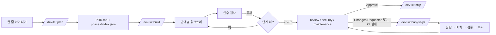
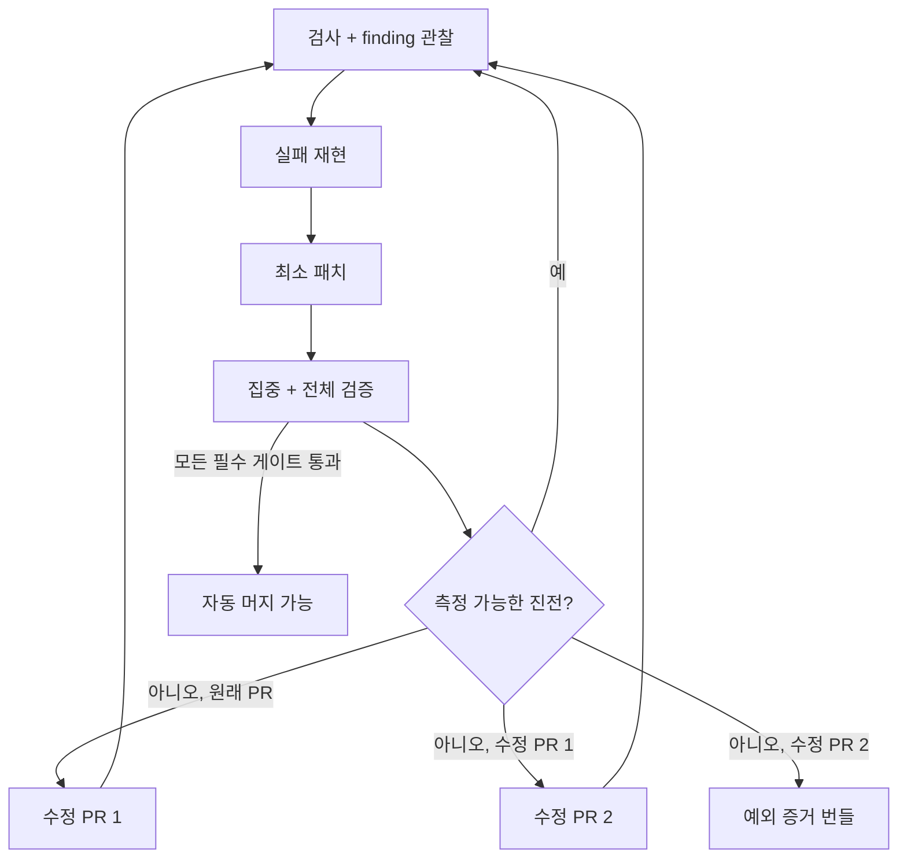
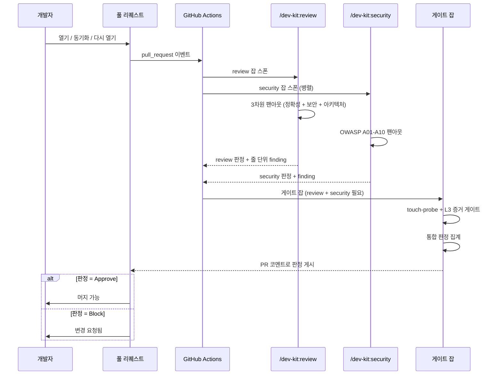

# dev-harness-kit

> Claude Code와 Codex에 실제 코드를 계획(build)하고, 빌드하고, 리뷰하고,
> 배포하는 반복 가능한 방법을 제공하는 플러그인 — 모델이 말로 빠져나갈
> 수 없는 가드레일을 함께 제공.

[](LICENSE)

**언어:** [English](README.md) · 한국어

---

## 무엇인가?

`dev-harness-kit`은 프로젝트에 **하나의 플러그인**(`dev-kit`)을 설치한다.
설치 후에는 항상 같은 루프를 따르는 슬래시 명령어 몇 개로 실제 개발
작업을 진행한다:

```
bootstrap → plan → build → review → ship
```

각 단계는 한 가지 일을 한다. `plan`은 아이디어를 명세서와 빌드 단계
체크리스트로 바꾼다. `build`는 테스트를 돌리며 그 체크리스트를 한
단계씩 처리한다. `review`와 `ship`은 결과를 검증하고 릴리스를 찍는다.

핵심은 가드레일이다. dev-kit은 **훅**(hook)을 설치한다 — 모든 파일 편집과
셸 명령에서 자동으로 실행되는 작은 스크립트다. `main`에 바로 커밋하거나,
작업 브랜치 밖에서 파일을 편집하거나, 테스트 통과 없이 "완료"를 주장하는
행위 등을 차단한다. 이것은 코드로 **시행**되기 때문에, 모델이 그랬으면
좋겠다고 해도 건너뛸 수 없다.

Claude Code와 Codex 둘 다에서 작동하며, 같은 명령은 양쪽에서 같은 의미다.

**처음이라면** 가장 친근한 진입점은
[`docs/home/00-index.ko.md`](docs/home/00-index.ko.md)
([English](docs/home/00-index.md))다 — *왜* 이 시스템이 존재하는지
설명하고 60초 투어를 제공한다. 이 README는 설치, 가장 많이 쓰는 명령,
흐름이 일직선으로 흐르지 않을 때 무엇을 해야 하는지를 다룬다.

**MCP 통합은 의도적으로 범위 밖이다.** 이 플러그인은 슬래시 명령, 훅,
라이브러리 함수를 출하하며 MCP 서버 엔트리는 포함하지 않는다. 근거는
[docs/decisions/0001-no-mcp.ko.md](docs/decisions/0001-no-mcp.ko.md)에
있다.

---

## 설치

Claude Code CLI가 필요하다. **`claude plugin …` 명령은 모두 Node 22에서 실행한다** —
번들된 CLI는 Node 25 이상에서 크래시한다:

```bash
nvm install 22 && nvm use 22
```

플러그인 설치:

```bash
# 권장: 마켓플레이스에서
claude plugin marketplace add sh-ai-x/dev-harness-kit
claude plugin install dev-kit

# …또는 로컬 클론에서
git clone https://github.com/sh-ai-x/dev-harness-kit
claude plugin marketplace add ./dev-harness-kit
claude plugin install dev-kit

# 매 세션 시작 시
/reload-plugins
```

설치는 `.claude-plugin/plugin.json`의 `version`을 고정하고 로드된 사본을
버전 이름이 붙은 캐시 폴더
(`~/.claude/plugins/cache/dev-kit/dev-kit/<version>/`)에 보관한다.
마켓플레이스는 `main` 브랜치를 추적하므로, 각 머지 후 새 버전을 사용할
수 있다 — [플러그인 최신 상태 유지](#플러그인-최신-상태-유지) 참고.

**이 저장소 자체에 작업한다면?** 로컬 체크아웃을 가리키면 재설치 없이
편집 내용이 바로 반영된다(이 경로는 Node 25 버그도 우회한다):

```bash
claude --plugin-dir /path/to/dev-harness-kit
```

`~/.zshrc` 또는 `~/.bashrc`에 둘 별칭:

```bash
alias claude-dev='claude --plugin-dir /path/to/dev-harness-kit'
```

> **`~/.claude/skills/dev-kit`을 이 저장소로 심볼릭 링크하지 말 것.**
> 같은 이름의 마켓플레이스 설치와 skills-dir 플러그인이 충돌하고, 로더가
> 두 번째 사본을 거부한다. 위 별칭을 대신 사용한다.

---

## 빠른 시작

새 저장소라면 한 명령으로 첫 설정을 마친다:

```bash
/dev-kit:bootstrap
```

이 명령은 이제 ci-setup을 묻는다 (프롬프트의 기본값은 Y; 거절하려면
`--skip-ci`, 자동 수락하려면 `--yes`). Y인 경우 프로젝트 파일 세 개
(`CLAUDE.md`, `AGENTS.md`, 훅 설정)를 **작성함과 동시에** CI 템플릿을
설치한다 — 기존 `/dev-kit:bootstrap-full` 동작과 일치. 절반만 필요하면
`/dev-kit:bootstrap --skip-ci` 또는 `/dev-kit:ci-setup --force`를 따로
실행한다.

여기서부터 평상시 루프는 세 명령이다:

```bash
/dev-kit:plan      # 아이디어를 명세 + 빌드 단계 목록으로 바꾼다
/dev-kit:build     # 그 목록을 한 단계씩 처리하며 테스트도 함께 돌린다
/dev-kit:review    # 완성된 diff를 정확성/보안/설계 측면에서 검증한다
```

각 명령이 디스크에 남기는 결과물로 진행 상황을 볼 수 있다:

- **`/dev-kit:plan`** → `PRD.md`(명세)와 `phases/<name>/` 폴더. 폴더에는
  단계별 파일 + 각 단계 상태를 추적하는 `index.json`.
- **`/dev-kit:build`** → 단계별로 코드 작성 + 인수 검사 실행 + `index.json`에
  `completed` 표시.
- **`/dev-kit:review`** → diff를 읽고 판정(Approve / Changes Requested / Blocked)을
  줄 단위 finding과 함께 반환.

리뷰가 통과되면 `/dev-kit:ship`이 릴리스 태그를 찍는다. 이게 전부다.

### 워크플로를 한눈에

가장 중요한 상태 전이는 의도적으로 작고 재개 가능하다. 전체 Code-Viz
출처 기록은 [unified-repair-coordinator.md](docs/workflows/unified-repair-coordinator.md).



`plan`은 구현 전에 의도와 인수 기준을 기록한다. `build`는 한 단계씩
담당하며 `index.json`에서 재개한다. `babysit-pr`은 단일 수정 진입점이다
— CI와 리뷰를 감시하고, 제한된 패치를 적용하고, PR을 다시 검증한다.



GitHub의 `auto-fix-pr`은 같은 수정 상태로 들어가는 이벤트 어댑터일
뿐, 별도의 사용자용 워크플로가 아니다.

### 이식성 및 장기 실행 루프

현재 계약은 두 개의 작은 CLI로 검증한다.

```bash
python3 tools/portability_check.py --json
python3 tools/loop_engine.py iterate --feature-list feature_list.json
python3 tools/loop_engine.py verify --feature-list feature_list.json
```

첫 번째 명령은 Claude/Codex manifest와 훅 이벤트·matcher·명령 parity,
셸 문법을 읽기 전용으로 검사한다. 두 번째 명령은 의존성이 풀린
`failing` feature 하나를 결정론적으로 골라 테스트하고
`.dev-kit/loop-checkpoint.json`에 결과를 원자적으로 기록한다. 테스트가
통과해도 feature 상태를 자동으로 바꾸지 않으므로, 검증되지 않은 완료
주장이 생기지 않는다. 세 번째 명령은 새 세션에서 checkpoint와 feature
목록의 일관성을 확인한다. `ci-setup`이 두 CLI를 소비자 저장소에도
설치하므로 플러그인 checkout 경로에 의존하지 않는다.

자세한 계약은 [`PORTABILITY-AND-LOOP.ko.md`](docs/architecture/PORTABILITY-AND-LOOP.ko.md)에 있다.

> "새 저장소가 있다"의 풀 워크스루(저장소 생성 → 설치 → 부트스트랩 →
> 첫 커밋)는 [최초 설정, 엔드투엔드](#최초-설정-엔드투엔드)를 참고한다.

---

## 시각화: 워크플로가 다이어그램이 되는 방식

`/dev-kit:code-viz`는 플러그인을 탐색해서 여러 단계의 뷰
(아키텍처 → 코드 → 스킬 → 훅 → tools → 외부)와 스킬별 워크플로
추출이 포함된 자기 완결 HTML 한 파일을 출력한다. 사용하는 패턴은
재사용 가능하다 — GitHub Actions 파이프라인, 다단계 수정 루프,
명확한 단계를 가진 다른 장기 실행 프로세스를 렌더링하는 데 같은
방식을 쓸 수 있다.

### GitHub Actions 게이트 워크플로

배포된 `review.yml`은 PR → review/security 팬아웃 → 게이트 판정
시퀀스를 정의한다. code-viz는 이걸 `sequenceDiagram`으로 출력한다.
같은 형태는 ```mermaid``` 펜스로 GitHub에서 깨끗하게 렌더링된다:



### 스킬별 워크플로 추출

사용자 호출 가능한 각 스킬에 대해 code-viz는 다섯 가지 전략을 순서대로
시도한다 — 첫 번째 매치가 채택되고, 이전 전략이 항목 2개 미만을 산출할
때만 다음 전략으로 폴백한다:

1. **도메인-콘텐츠 섹션** — `## Categories`, `## Dimensions`, `## Audit
   areas`, `## Checks`에 굵은 글머리표(예: security의 A01–A10, inspect의
   8개 차원).
2. **`[N/M] LABEL → desc`** — `plan`의 5단계 프레이밍이 사용.
3. **`## Gate N/M — label` / `## Phase N — label`** — 번호가 붙은 게이트.
4. **`## Algorithm` 아래 번호 목록** — `babysit-pr`의 14단계 수정 루프.
5. **`## <섹션이름>` 헤더** 를 암묵적 단계로 사용.

추출 가능한 워크플로가 없는 스킬은 "워크플로 미감지" 섹션의 텍스트
칩으로만 표시되고, 빈 다이어그램으로 시각화되지는 않는다.

### 루프-백 감지

루프가 있는 워크플로는 점선, 라벨이 붙은 백엣지(back-edge)를 가진다
— 단순한 위→아래 직선이 아니다:

- **명시적** — 단계 자체의 텍스트에 `goto N`이 있는 경우
  (예: babysit-pr의 13단계는 "그렇지 않으면 `goto 1`"). 백엣지는 참조된
  단계를 가리키며 `retry -> step N` 라벨을 가진다.
- **암묵적 폴백** — 명시적 goto는 없지만 스킬 본문이 인식된 루프
  언어를 사용(`3-cycle self-fix`, `repeat until`, `safety_valve` 상한, …).
  마지막 단계가 첫 단계로 루프백한다 — "프로세스가 반복된다"가 유일하게
  말이 되는 기본값이기 때문이다.

`python` 펜스 코드 블록은 암묵적 키워드 스캔 전에 제거된다 — 스킬 자신의
소스 코드(이 문서 포함)는 디텍터의 패턴 문자열을 마치 실제 루프를
설명하는 산문처럼 매치할 수 있다.

### 엣지 시맨틱

모든 다이어그램의 모든 엣지는 실제 관계를 나타낸다 — 레이아웃
아티팩트가 절대 아니다:

- **순차(체인 화살표)** — 실제 before/after 관계가 존재하는 경우에만
  사용: 스킬별 워크플로 단계, 하나의 Claude 이벤트 내의 훅들
  (배열 선언 순서대로 실행됨).
- **팬아웃(형제 엣지 없음)** — 모든 순수 인벤토리에 사용: `lib/`,
  `bin/`, `tools/` 모듈, 디렉터리 목록, GitHub Actions 워크플로,
  MCP 서버, 서드파티 CLI 호출, 도메인 필러 맵. 루트가 모든 항목에
  직접 팬아웃 — 실제 의존 관계가 없는 형제 사이에 가짜 순서를 만들지
  않는다.

5개 항목을 초과하는 행 그룹은 테두리/채움 없는 subgraph(빈 제목)로
렌더링된다 — 레이아웃 보조일 뿐 컨테이너가 아니다. 연속된 인벤토리
행은 Mermaid의 보이지 않는 연산자(`~~~`)로 묶어 실행 순서를 의미하지
않고 수직 스택만 강제한다.

---

## 가장 많이 쓰는 스킬

스킬은 많지만, 실제로 손이 가는 것은 이것들이다. 모든 슬래시 명령은
`/dev-kit:<name>` 형태이며, 각 항목은 상세 페이지로 연결된다.

### 프로젝트 설정

| 명령 | 하는 일 |
|---|---|
| [`/dev-kit:bootstrap`](docs/skills/bootstrap.ko.md) | 새 저장소의 첫 진입 — `CLAUDE.md`, `AGENTS.md`, 훅 설정을 작성. |
| [`/dev-kit:bootstrap`](docs/skills/bootstrap.ko.md) | `bootstrap` + `ci-setup`을 한 번에. 신규 프로젝트 기본 진입점. |
| [`/dev-kit:ci-setup`](docs/skills/ci-setup.ko.md) | dev-kit의 CI 워크플로와 훅을 저장소에 설치해 PR에서 같은 검사가 돌게 한다. |
| [`/dev-kit:ci-doctor`](docs/skills/ci-doctor.md) | 읽기 전용 검사 — "CI가 제대로 설정됐는가? 다음 PR이 통과할 것인가?"에 답한다. |

### 계획과 빌드

| 명령 | 하는 일 |
|---|---|
| [`/dev-kit:evidence-plan`](docs/skills/evidence-plan.md) | 아이디어 → 인용된 리서치 → HTML 제안서(사용자 확인) → `/dev-kit:plan` 핸드오프 — 비용이 큰 5-게이트 PRD 작업 전에 실행. |
| [`/dev-kit:plan`](docs/skills/plan.ko.md) | 아이디어를 `PRD.md` + 단계별 빌드 체크리스트로 바꾼다. |
| [`/dev-kit:build`](docs/skills/build.ko.md) | 체크리스트를 한 단계씩 처리하며 테스트와 코드를 작성하고 각 단계를 검증. |
| [`/dev-kit:build-debug`](docs/skills/build-debug.md) | 4단계 근본원인 디버깅(재현 → 격리 → 근본원인 → 수정). 단독 호출 시 근본원인을 인라인으로 고치는 대신 `/dev-kit:plan`으로 넘긴다. |
| [`/dev-kit:proposal`](docs/skills/proposal.md) | `docs/proposals/<main>/<sub>.yaml`을 before/after 구조 + 장단점/한계를 포함한 자기 완결 HTML 페이지로 렌더링해 구현 전에 리뷰할 수 있게 한다. |

### PR 통과시키기

| 명령 | 하는 일 |
|---|---|
| [`/dev-kit:babysit-pr`](docs/skills/babysit-pr.md) | 열린 PR을 감시해 실패한 검사를 고치고 푸시하며, CI 통과 + 리뷰 승인까지 반복. |
| [`/dev-kit:pr-verify`](docs/skills/pr-verify.md) | 결정론적 5게이트 PR 검증기 — 게이트마다 신선한 `gh` 상태를 페치해 "오래된 CI" / "LLM-judge 진행 중" 허위 양성을 잡아낸다. |
| [`/dev-kit:bump`](docs/skills/bump.md) | 명시적인 로컬 `plugin.json` 버전 범프 + `chore/bump-vX.Y.Z` 푸시 — 레이스 복구 및 PR 전 명시적 범프용. |

### 프로젝트 건강 유지

| 명령 | 하는 일 |
|---|---|
| [`/dev-kit:inspect`](docs/skills/inspect.md) | 읽기 전용 전체 코드베이스 건강 스캔(죽은 코드, 중복, 스멜) → 리포트 1부. |
| [`/dev-kit:refactor`](docs/skills/refactor.md) | 3단계 정리 체인 — `inspect → build-refactor → review` 각 게이트 사이에 종료 코드 인용. |
| [`/dev-kit:prune`](docs/skills/prune.md) | 슬롭 제거 체인 — `inspect → 3회차 삭제 스윕 → review`. AI 슬롭이나 죽은 기능을 (리팩터가 아니라) 제거하고 싶을 때 손을 댄다. |
| [`/dev-kit:status`](docs/skills/status.md) | HOTL 시각화 — 현재 루프 진행도, 누적 사이클, 핸드오프 체인, 평가 점수를 한 화면에. |
| [`/dev-kit:code-viz`](docs/skills/code-viz.md) | 범용 플러그인 아키텍처 시각화 — 다중 레벨 뷰 + 도메인 필러 맵 + 스킬별 워크플로를 자기 완결 HTML 1페이지로. |
| [`/dev-kit:token-analyzer`](docs/skills/token-analyzer.md) | Claude Code / Codex 토큰 비용이 어디로 가는지를 HTML 대시보드로 보여준다. |
| [`/dev-kit:research`](docs/skills/research.md) | 모든 사실 주장에 출처를 붙이거나 제거한다. |
| [`/dev-kit:docs-maintenance`](docs/skills/docs-maintenance.md) | 오래된 문서를 감사하고 README를 새로 고치되 시점에 따라 변하는 사실은 박아두지 않는다. |
| [`/dev-kit:ci-triage`](docs/skills/ci-triage.md) | 최근 커밋의 실패한 GitHub Actions 런을 분류하고 영속화된 케이스 저장소와 중복 제거 후 모델/컨텍스트/하네스 분류로 새 실패를 판정 — 모든 케이스는 재현 가능한 repro + 실행 가능한 회귀 테스트를 가져야 한다. |
| [`/dev-kit:log`](docs/skills/log.md) | 세션 로깅을 켜고 끈다. `token-analyzer`, `skill-usage`, 세션 모니터가 데이터로 쓸 수 있게 한다. |
| [`/dev-kit:skill-usage`](commands/skill-usage.md) | 어떤 스킬을 실제로 얼마나 쓰는지 보여준다 — 가지치기에 유용. |
| [`/dev-kit:sot-harness-writer`](docs/skills/sot-harness-writer.md) | 5라운드 × 2–3개의 증거 기반 추천을 인터뷰하는 Single Source of Truth 하네스 문서 작성기 — `/dev-kit:plan`으로 핸드오프한다. |
| [`/dev-kit:learn`](docs/skills/learn.md) | 소스 텍스트(파일, URL, 산문, 또는 세션 트랜스크립트)를 후보 `SKILL.md`로 증류 — 결정론적 G1–G5 검사 + 후보별 승인 단계를 거친다. |

위 목록을 넘어서는 전체 스킬의 최신 목록은
[`docs/skills/README.ko.md`](docs/skills/README.ko.md)를 참고한다. 카테고리별로
묶여 있고 한 줄 요약이 붙어 있다. `/dev-kit:`만 입력하고 자동완성에
떠오르는 목록을 봐도 된다.

> **스킬 이름에 대한 메모:** 자동완성에 안 뜨는 이름은 모델이 스스로
> 호출하는 내부 헬퍼다 (`build` 내부의 `build-tdd` 등) — 헬퍼를 직접
> 입력하는 게 아니라 부모 명령을 입력한다. 단순한 규칙: 사용자가 부르는
> 명령은 **동사**, 내부 스킬은 **기계**.

---

## 흐름이 일직선으로 흐르지 않을 때

실제 작업은 멈췄다가, 뒤돌아가다가, 단계를 건너뛴다. 흔한 경우의 짧은
버전은 다음과 같다. 예시별 풀 워크스루는
[`docs/workflow/WORKFLOW-SCENARIOS.ko.md`](docs/workflow/WORKFLOW-SCENARIOS.ko.md)에
있다.

**빌드 중 중단됐다.** 그냥 `/dev-kit:build`를 다시 실행한다. 빌드는 각
단계 상태를 `phases/<name>/index.json`에
`unimplemented → pending → in_progress → completed`로 추적하며, 재실행은
항상 `completed`가 아닌 첫 단계부터 이어간다. 2단계 후 랩탑을 닫으면
다음 실행은 별도 플래그 없이 3단계부터 시작한다.

**단계 진행 중에 계획이 틀렸다는 게 드러났다.**
[`/dev-kit:adapt`](commands/adapt.md)를 실행한다. 진행 중인 단계를
일시 중지하고, 계획과 실제 출력이 어긋나는 지점을 보여주고, 명세/단계
파일에 대한 작은 패치 하나를 제안하며 — 사용자가 승인한 **뒤에만** 패치를
작성하고 빌드를 재개한다. 작은 수정에 쓰고, 계획 전체가 뿌리부터 틀렸다면
대신 `/dev-kit:plan`을 다시 실행한다.

**다음 날 또는 다른 터미널**로 돌아왔고 어디까지 했는지 잃어버렸다.
`python3 tools/session_monitor.py`를 실행한다. 저장소 워크트리 전반의
최근 세션을 나열하고, 정확한 재개 명령을 알려준다(`/dev-kit:log`이 켜져
있어야 기록이 있다 — 아래 [세션 모니터](#세션-모니터) 참고).

**Valuate 단계를 건너뛰고 싶다.** 그렇게 해도 된다 — 권고 단계일 뿐이다.
`valuate`는 계획이 빌드할 가치가 있는지 점수를 매기지만, 빌드는 어쨌든
진행된다(이전 하드 게이트는 PR #463에서 제거됨). 참고로 PR #589부터
`valuate`는 **모델 호출 전용**이며 — `/dev-kit:plan` 등 계획 단계가
내부적으로 루브릭을 호출한다. 슬래시는 사용자 메뉴에 더 이상
노출되지 않는다. 따라서 "건너뛰기"는 그 단계들이 명시적 판정 호출 없이
그냥 진행되도록 두는 것을 의미한다. 작고 자명한 작업은 건너뛰고,
큰 베팅에는 sanity check 용으로 의존한다.

**전체 계획 없이 Build로 직행하고 싶다.** 현재로는 **원커맨드 우회
방법이 없다.** 정직한 선택지는 `/dev-kit:plan`을 매우 좁게 범위화하거나
(1–2단계 계획을 빠르게 뱉을 수 있다) 최소 `phases/<name>/index.json`을
직접 시드하는 것이다. [워크플로 시나리오 문서](docs/workflow/WORKFLOW-SCENARIOS.ko.md#case-5-전체-계획-없이-build로-직행)에서
두 방법과 제거된 `tdd-fast` / `quick-fix` 단축키가 옵션이 아닌 이유를
설명한다.

---

## 워크트리 규칙 (꼭 읽으세요)

이것이 newcomers가 가장 놀라게 되는 단 하나의 하드 규칙이며, 훅이
강제하므로 의도치 않게 빠질 수 없다.

> **모든 작업은 자기만의 git 워크트리와 브랜치를 가진다.** 메인
> 체크아웃에서 파일을 편집하지 않으며, `main`에 직접 커밋/푸시하지
> 않는다.

워크트리는 분리된 브랜치의 격리된 두 번째 사본이다. 메인 체크아웃에서
새 작업을 시작하면 플러그인이 자동으로 잘라주거나 직접 잘라도 된다:

```bash
git worktree add -b feat/my-task .worktrees/feat-my-task origin/main
```

그 폴더 안에서 작업한다. 메인 체크아웃에서 편집하려고 하면
`worktree-guard` 훅이 편집을 차단하고 라이브 워크트리 목록을 출력해
들어갈 곳을 알려준다. 전체 규칙(브랜치 명명, 정확한 프로토콜, 강제하는
훅)은 [`rules/git-workflow.md`](rules/git-workflow.md)에 있다.

---

## 문서 맵

이 저장소는 `docs/<주제>/` 아래 주제별 문서 약 20개를 제공한다. HTML/MD/
한국어 형제/각 문서가 제공하는 것을 분류한 전체 표는
[`docs/home/DOC-MAP.md`](docs/home/DOC-MAP.md)에 있다.

**시작점:**

| 하고 싶은 것 | 열 파일 |
|---|---|
| 5분 안에 *왜*를 배우기 | [`docs/home/00-index.ko.md`](docs/home/00-index.ko.md) 1–3절 |
| 새 저장소에 dev-kit 연결 | [`docs/quality/ci-setup.ko.md`](docs/quality/ci-setup.ko.md) |
| 모든 단계를 한곳에서 보기 | [`docs/stages/STAGES.ko.md`](docs/stages/STAGES.ko.md) |
| 망가진 흐름에서 복구 | [`docs/workflow/WORKFLOW-SCENARIOS.ko.md`](docs/workflow/WORKFLOW-SCENARIOS.ko.md) |
| 비용 감사 또는 사실 주장 검증 | [`docs/observability/token-efficiency.ko.md`](docs/observability/token-efficiency.ko.md) |
| 새 셸에서 세션 재개 | [`docs/observability/session-monitor.ko.md`](docs/observability/session-monitor.ko.md) |
| 이 저장소가 제공하는 커스텀 서브에이전트 보기 | [`docs/proposals/agent-architecture/multi-agent-design.md`](docs/proposals/agent-architecture/multi-agent-design.md) |

나머지 — HTML 형제, 한국어 문서, 깊은 레퍼런스 — 는
[`docs/home/DOC-MAP.md`](docs/home/DOC-MAP.md)에 있다. 5분이 있다면
[`docs/home/00-index.ko.md`](docs/home/00-index.ko.md)의 처음 3절(왜,
빠른 시작, 가치)을 읽어도 된다. 나머지는 나중에도 된다.

---

## 최초 설정, 엔드투엔드

"새 저장소가 있다"의 전체 흐름:

```bash
# 1. 생성 + 클론
gh repo create myorg/myrepo --private --clone && cd myrepo

# 2. 플러그인 설치
claude plugin marketplace add sh-ai-x/dev-harness-kit
claude plugin install dev-kit
# (라이브 소스: claude --plugin-dir /path/to/dev-harness-kit)

# 3. 원샷 설정: CLAUDE.md + AGENTS.md + 훅 설정 + CI 템플릿
/dev-kit:bootstrap

# 4. 첫 커밋 + 푸시
git add -A && git commit -m "chore: bootstrap dev-kit"
git push -u origin main
```

**최초 설치에는 `--force`를 사용한다** (`/dev-kit:ci-setup --force`,
`bootstrap`이 대신 실행해준다). 새 저장소에서는 결과가 기본 설치와
동일하지만, `--force`는 이전 시도의 부분 실패나 오래된 플러그인 캐시에
대해서도 견고하다. 새 템플릿을 받기 위해 나중에 `--force`로 다시 실행해도
된다 — 자세한 차이는 [소비자 CI 설치](#소비자-ci-설치) 참고.

일반적인 다음 단계: `/dev-kit:plan`으로 명세와 빌드 단계를 생성.

---

## 플러그인 최신 상태 유지

마켓플레이스 설치는
`~/.claude/plugins/cache/dev-kit/dev-kit/<version>/`의 캐시 사본을 사용한다.
PR이 `main`에 머지된 후에는 새로 고치기 전까지 그 캐시는 오래된 상태다.

**새로 고치는 시점:** PR이 머지되었고 새 동작을 지금 쓰고 싶을 때,
`/dev-kit:*` 출력이 최신 소스와 더 이상 맞지 않을 때, 소비자 저장소의
`ci-setup`이 누락 파일을 보고할 때.

**Claude Code** — 어떤 셸(Claude Code 세션 내부 포함)에서도 깔끔하게
동작하는 경로:

```bash
claude plugin update dev-kit
```

실패하면(보통 세션 내부에서 Node 버그가 나는 경우) 탈출구 스크립트가
같은 일을 `git pull` + `rsync`로 수행한다:

```bash
bin/devkit-refresh.sh
bin/devkit-refresh.sh --dry-run    # 먼저 미리 보기
```

**Codex** — 손을 대는 순서대로 세 가지 경로:

```bash
# 1. Codex 세션 내부 — 슬래시 메뉴. 세션 내 스킬 캐시를 새로 고쳐
#    /dev-kit:*가 즉시 새 버전을 쓰게 한다. /skills를 입력하고
#    "Update" 선택.
/skills  →  Update

# 2. 어떤 셸에서든 — CLI 마켓플레이스 업데이트. 마켓플레이스 클론을
#    새로 고친다(참고: 이미 최신이라고 보고하면서 버전별 캐시가
#    오래된 상태로 남을 수 있다; 증상이 계속되면 #3으로).
codex plugin marketplace upgrade dev-kit

# 3. 탈출구 — #2 + 마켓플레이스 체크아웃을 버전별 캐시 디렉터리로
#    명시적 rsync. CLI를 못 쓸 때나 #2가 성공으로 보고했는데도 캐시가
#    오래된 세션에서 쓰임.
bash skills/codex-cache-update/scripts/update.sh
bash skills/codex-cache-update/scripts/update.sh --dry-run    # 먼저 미리 보기
```

마켓플레이스/캐시 경로 재정의(자동 감지가 틀렸을 때):

```bash
CODEX_MARKETPLACE_DIR="/custom/path/to/marketplaces/dev-kit" \
CODEX_CACHE_ROOT="/custom/path/to/cache/dev-kit/dev-kit" \
bash skills/codex-cache-update/scripts/update.sh
```

**라이브 소스 개발(기여자에게 권장)** — 캐시를 완전히 우회해 Codex를
로컬 체크아웃으로 가리킨다. 재설치 없이 편집이 바로 반영된다:

```bash
codex --plugin-dir /path/to/dev-harness-kit
```

새로 고친 후에는 클라이언트를 재시작하거나, 지원되는 경우
`/reload-plugins`를 실행한다.

---

## 소비자 CI 설치

`/dev-kit:ci-setup`이 dev-kit의 검사를 **당신의** 저장소에서도 돌게 만든다.
GitHub Actions 워크플로(ci, auto-fix-pr, review), 헬퍼 스크립트(validate,
test, branch-policy, ci-local), pre-push 훅, 워크트리 규칙 파일을 복사해
넣는다. 배포된 `review.yml`은 셀프 어웨어다 — 같은 파일이 dev-kit
플러그인 자체에서도, 일반 소비자 저장소에서도 동작한다.

`ci-setup`은 **멱등(idempotent)**이다. 마커 파일
(`.dev-kit/ci-config.json`)이 무엇이 설치됐는지 기록하므로, 같은 재실행은
아무것도 하지 않는다. 최초 설치, 새 템플릿 가져오기, 오래된 설치 의심
시에 `--force`를 쓴다. 업스트림 변경 없이 깨끗하게 재실행하거나, 설치된
파일을 사용자가 직접 수정한 경우에는 `--force`를 피한다 — 로컬
커스터마이즈를 덮어쓰니 먼저 diff를 본다.

```bash
bin/devkit-refresh.sh                                              # 1. 캐시 새로 고침
cd /path/to/consumer-repo
/dev-kit:ci-setup --force                                          # 2. 설치
git diff .github/ scripts/ .githooks/ hooks/ .claude/ tests/       # 3. 검토
/dev-kit:ci-doctor                                                 # 4. 검증 (PASS까지 반복)
git add -A && git commit -m "chore(ci): refresh dev-kit templates" # 5. 커밋
```

**CI 리뷰 프로바이더 선택**은 환경변수 기반이며, 커밋된 기본값이 없어서
같은 저장소에서 운영자마다 다른 프로바이더를 쓸 수 있다. 로컬에서는
`.env`(gitignored, 사용자별, `bin/set-provider.sh <provider>`로 관리)
에서 `CI_REVIEW_PROVIDER`를 설정한다. CI에서는 GitHub 리포지토리
변수 `vars.CI_REVIEW_PROVIDER`와 매칭 시크릿을 설정한다.

**첫 PR 전에 GitHub에서 설정할 것:**

| 프로바이더 | 리포지토리 변수(프로바이더 선택) | 리포지토리 시크릿(API 키) |
|---|---|---|
| `minimax`(기본) | `CI_REVIEW_PROVIDER` | `MINIMAX_API_KEY` |
| `anthropic` | `CI_REVIEW_PROVIDER` | `ANTHROPIC_API_KEY` |
| `deepseek` | `CI_REVIEW_PROVIDER` | `DEEPSEEK_API_KEY` |

```bash
# 1. 프로바이더 선택 (변수 — 워크플로에서 보임)
gh variable set CI_REVIEW_PROVIDER --repo <owner>/<repo> --body minimax

# 2. 매칭 API 키 입력 (시크릿 — 로그에서 마스킹됨)
gh secret set MINIMAX_API_KEY --repo <owner>/<repo>

# 3. (sh-ai-x/dev-harness-kit의 fork가 비공개일 때만) — 액션이
#    템플릿을 pull할 수 있도록 그 리포 범위의 PAT.
gh secret set DEV_KIT_GITHUB_TOKEN --repo <owner>/<repo> --app actions
```

둘 다 존재하고 프로바이더가 허용 목록에 있는지 확인:

```bash
gh variable list --repo <owner>/<repo> | grep CI_REVIEW_PROVIDER
gh secret list --repo <owner>/<repo> | grep -E 'MINIMAX|ANTHROPIC|DEEPSEEK'
bin/set-provider.sh                          # 로컬 확인: 현재 프로바이더 + 허용 목록 + 전환 힌트
```

`/dev-kit:ci-setup`에 `--setup-secrets`를 넘기면 수동 `gh` 호출을 생략할
수 있다 — `CI_REVIEW_PROVIDER`를 읽고, `required_secrets_for_provider()`
로 필수 시크릿을 나열한 뒤 `gh secret set` 호출 전에 각각을 묻는다. 시크릿
설정이 실패해도 설치는 계속 성공한다 — 경고로 표시될 뿐 오류가 아니다.

자세한 내용과 Codex 측 설정은 [`docs/quality/ci-setup.ko.md`](docs/quality/ci-setup.ko.md)에
있다.

---

## 도구 레퍼런스

### 세션 로깅(`/dev-kit:log`)

세션 로깅이 토큰 분석기, 스킬 사용량 리포트, 세션 모니터에 데이터를
공급한다 — 켜기 전에는 셋 다 데이터가 없다.

```bash
/dev-kit:log setup   # logs/{claude-code,codex}/ 스캐폴드 + 로그 도구 복사
/dev-kit:log on      # 이 프로젝트 설정에 로그 훅 설치
/dev-kit:log status  # managed=N captured=N
/dev-kit:log off     # dev-kit의 로그 훅만 제거; 사용자의 다른 훅은 유지
```

캡처된 트랜스크립트는 `logs/<tool>/<branch>/<sid>.jsonl`에 떨어지며
gitignored다. [`docs/skills/log.md`](docs/skills/log.md) 참고.

### 토큰 효율 + 리서치

두 스킬이 같은 명제를 공유한다: **모든 주장은 출처가 붙거나 제거된다**.
`/dev-kit:token-analyzer`는 **비용** 면에서 이를 시행한다 — `/dev-kit:log`
트랜스크립트를 자기 완결 HTML 대시보드로 재생하고, 각 세션을 4개 차원으로
점수 매기고, 6개 비용 안티패턴을 플래그하며, USD 절감액을 추정한다.
`/dev-kit:research`는 **인용** 면에서 이를 시행한다 — 모든 사실 주장에는
`url + fetched_at + source_type`이 붙거나, 리뷰어가 고치도록 `[UNCITED]`
접두사가 붙는다. 둘 다 모델이 말로 빠져나갈 수 없는 읽기 전용 데이터
계층이다.


플래그, 4차원 점수 루브릭, 6개 경고 트리거, 가격 표, Phase 0 → 3 인용
에스컬레이션은 모두 [`docs/observability/token-efficiency.ko.md`](docs/observability/token-efficiency.ko.md).
단일 스킬 카드는 [`docs/skills/token-analyzer.md`](docs/skills/token-analyzer.md)와
[`docs/skills/research.md`](docs/skills/research.md).

### 비용 게이트

별도의 **읽기 전용** 비용 계층: `/dev-kit:cost-gate`가 요청 시 실행
지출 원장을 출력하고 PR 집계기가 필요로 하는 트레일러 블록을 발행한다.
도구 호출을 차단하지 않는다 — 관찰 전용. 임계값, 오버라이드 환경변수,
트레일러 포맷은 [`docs/skills/cost-gate.md`](docs/skills/cost-gate.md).

### 세션 모니터

`tools/session_monitor.py`는 *"터미널을 닫았는데 그 빌드로 어떻게
돌아가죠?"* 에 답한다 — 일시 중지된 세션을 찾아 다시 들어가게 해준다.
CLI 형태는 진짜 CLI 친화적이다: 셸 어디서나 평범한 `--list`가 동작하고,
피커는 진짜 TTY가 필요하며, `--print-resume-command`는 `cd <wt> &&
claude --resume <sid>` 한 줄을 `!`로 실행할 수 있도록 출력한다.


```bash
python3 tools/session_monitor.py                       # 인터랙티브 피커 (진짜 TTY)
python3 tools/session_monitor.py --list --days 30       # 평범한 리스트, 모든 셸
python3 tools/session_monitor.py --json --days 30        # 기계가 읽을 수 있는 형태
python3 tools/session_monitor.py --print-resume-command  # 재개 명령을 출력하고 종료
python3 tools/session_monitor.py --cli-setup             # `session-monitor` 셸 별칭 설치
```

Enter를 누르면 피커가 세션의 워크트리로 이동해 대화를 다시 열고
(`claude --resume <sid>` 또는 `codex resume <sid>`); 워크트리가 사라졌다면
경고와 함께 메인 체크아웃으로 폴백한다.

**더 알아보기** — 모든 플래그, 상태 글리프 시맨틱, 피커 아키텍처
(termios + ANSI, curses 미사용), "왜 스킬과 함께 도구인가" 근거는
[`docs/observability/session-monitor.ko.md`](docs/observability/session-monitor.ko.md).
"언제" 손을 대는지 서사(다른 터미널/다른 날에서 재개)는
[워크플로 시나리오, Case 3](docs/workflow/WORKFLOW-SCENARIOS.ko.md#case-3-다른-터미널또는-날에서-돌아옴) 참고.

### 스킬 사용량(`/dev-kit:skill-usage`)

같은 로깅 세션에 대한 스킬별 텔레메트리: 각 스킬이 몇 턴을 이끌었고
몇 번 명시적으로 호출됐는지 보여준다. 턴이 많고 호출이 적으면 베이비시터
루프 신호, 둘 다 낮으면 가지치기 후보.

```bash
python3 tools/skill_usage.py                 # 상위 스킬, 30일 윈도우
/dev-kit:skill-usage                         # 같은 결과를 명령어 래퍼로
python3 tools/skill_usage.py --top 0         # 최근 사용 0인 스킬도 포함
python3 tools/skill_usage.py --cwd /path --days 7   # 한 워크스페이스, 새로운 윈도우
```

`--top 0`은 사용되지 않은 스킬도 나열한다 — 완전한 인벤토리에 유용.
캡처된 사용량 0을 절대 "이 스킬은 쓸모없다"의 증거로 읽지 말 것.

### 커스텀 서브에이전트 (프로젝트 로컬)

`agents/*.md`와 `agents/*.toml`은 Claude Code와 Codex가 디스패치할 수
있는 프로젝트 로컬 서브에이전트의 **일급 확장 지점**이다. 이는
전역 에이전트 페르소나(`~/.claude/agents/`, 내장 `backend-architect`,
`frontend-developer`, …)와 다르다 — 한 저장소의 도구에만 범위가
정해지며 저장소와 함께 배포되어 모든 기여자가 같은 감사 봇을 갖는다.

배포된 예시는 **`worktree-janitor`** — `.worktrees/*`에 대한 읽기
전용 감사로, 모든 워크트리 디렉터리를 `live` / `merged` / `gone` /
`fresh` / `unknown`으로 분류하고(`tools/token_efficiency_analyzer.py:
classify_all_worktrees()` 경유) `live`/`unknown`에 한해 제거 후보만
보고한다. 스스로 `git worktree remove`를 실행하지 않는다 — 오케스트레이터가
그 보고를 읽고 사람이 제거 명령을 실행한다. 새 프로젝트 로컬 서브에이전트
추가:

1. Claude Code는 `agents/<name>.md`에 표준 프런트매터 작성(`name:`,
   `description:`, `model:`, 선택적 `tools:` 허용 목록). Codex는
   `agents/<name>.toml`에 `name`, `description`, `developer_instructions`;
   감사자는 `sandbox_mode = "read-only"` 사용.
2. 린트 게이트 `tests/test_agent_governance.py`가 filename == 프런트매터
   `name:`, kebab-case, 비어있지 않은 description(인라인 또는 블록 스칼라),
   필수 Codex TOML 필드를 시행.
3. 기존 하네스 재사용 — `classify_all_worktrees`, `probe_working_tree_clean`,
   `classify_worktree_dir`이 이미 서브에이전트 사용용으로 export되어 있다;
   에이전트 파일에 재구현하지 말 것.

`worktree-janitor`의 제안 + 디스패치 컨텍스트 계약(배치를 오케스트레이터에
넘기는 측) 은 [`docs/proposals/agent-architecture/multi-agent-design.md`](docs/proposals/agent-architecture/multi-agent-design.md).
에이전트 도구 핸드오프 계약(디스패치 + 보고 두 봉투) 은
[`docs/architecture/multi-agent-orchestration-research.md`](docs/architecture/multi-agent-orchestration-research.md).

---

## 작동 원리

이 README를 읽을 수 있는 수준으로 유지하면서 더 깊은 자료로의 짧은 포인터.

**시행 훅**이 핵심 하중을 받는 부분이다 — 도구 호출을 단락하는 결정론적
가드(메인 체크아웃 편집 차단, 파괴적 `git`/`rm` 거부, 시크릿 마스킹,
테스트 우선 시행, 세션 종료 전 종료 코드 인용 요구). 스킬은 이 훅들과
빌드 상태 머신 위의 편의 래퍼다. 훅 전체 인벤토리(단계별, 각 훅을
발화시키는 이벤트별)는 [`docs/hooks/HOOK-REFERENCE.ko.md`](docs/hooks/HOOK-REFERENCE.ko.md).
알려진 커버리지 갭과 런타임별 배선 차이는
[`docs/hooks/hook-coverage-gaps.ko.md`](docs/hooks/hook-coverage-gaps.ko.md).

**각 단계가 읽고 쓰는 것**:

| 스킬 | 단계 | 읽기 | 쓰기 |
|---|---|---|---|
| `/dev-kit:plan` | Plan | 운영자 프롬프트 | `PRD.md`, `phases/<name>/step<N>.md`, `phases/<name>/index.json` |
| `/dev-kit:valuate` (내부) | Valuate | `.dev-kit/hand-off/plan*.md` | `.dev-kit/valuations/<plan-id>.json` |
| `/dev-kit:build` | Build | `phases/<name>/index.json` + 단계별 파일 | 단계별 `output.json` |
| `/dev-kit:review` | Review | PR diff | 판정 (Approve / Changes Requested / Blocked) |
| `/dev-kit:security` | Security | PR diff | OWASP별 판정 |
| `/dev-kit:ship` | Ship | Review 판정 + AC 출력 | `git tag` + CHANGELOG 항목 |

`/dev-kit:valuate`가 쓰는 판정 봉투(`decision` / `rationale` /
`blocking_findings`)는 `lib/valuation_engine.py:decision_is_canonical_envelope`로
고정되어 있다. 비-`proceed` 판정에 대해 Build를 하드 차단하던 자동
게이트가 #463에서 제거되었다 — 실제로 어떤 의미인지 [워크플로 시나리오
문서 Case 4](docs/workflow/WORKFLOW-SCENARIOS.ko.md#case-4-valuate-단계-건너뛰기) 참고.

**에이전트 행동 및 하네스 효과성 평가** — `/dev-kit:evaluate`는 기존
트랜스크립트/루브릭 평가를 유지한다. 하네스 효과성 설계는 legacy D1–D7
평가와 함께 workflow evidence를 사용해 prevention, first-pass, recovery,
learning, measurement integrity 5개 component를 별도로 보여준다. 누락된
evidence는 추정하지 않고 명시적으로 표시한다.
[`docs/skills/evaluate.md`](docs/skills/evaluate.md)에 상세 내용,
근거는 `docs/adr/ADR-0022-eval-agent-behavior.md`와
[`docs/proposals/harness-effectiveness/00-index.html`](docs/proposals/harness-effectiveness/00-index.html)이다.

**Codex 호환성** — 같은 스킬과 훅이 `.codex-plugin/` 매니페스트를 통해
정식 훅 설정을 미러링하는 Codex CLI에서도 동작한다; 회귀 테스트가 양쪽을
동기화 상태로 유지한다. 로컬 훅 상태 확인: `python3 bin/dev-kit-hooks-status.py`.
런타임 이식성은 [`docs/architecture/RUNTIME-PORTABILITY.ko.md`](docs/architecture/RUNTIME-PORTABILITY.ko.md).

**저장소 레이아웃** — 디렉터리별 가이드는
[repository map](docs/repo/REPOSITORY-MAP.ko.md).

**설계 원칙:**

- **NO-DUP** — Iron Law는 한 곳(`iron-laws/index.md`)에서만, 훅 + 스킬로
  시행. CLAUDE.md는 슬림 포인터 문서, 자세한 내용은 전용 `index.md` 파일에
  지연 로드 (iron-laws, guidelines, hooks, rules).
- **NO-BOTTLENECK** — 0-인자 UX, 슬림 포인터 CLAUDE.md, 병렬 서브에이전트.
- **NO-MEANINGLESS-LOOP** — 명시적 루프 시맨틱 + 자동 STOP + 사용자 인터럽트.
- **Human-on-the-Loop** — 사용자가 감독하고 1회 인터럽트 권한으로 자동 진행.
- **Methodology extension** — TDD / SDD / DDD / BDD / FDD 선택 가능.
- **A2A typed** — 서브에이전트 ↔ 메인 통신은 JSON-Schema SSOT로.
- **Plugin-only** — 플러그인 매니페스트가 단일 진실 공급원.
- **Worktree-per-task** — 훅으로 시행, `rules/git-workflow.md`에 문서화.
- **Consumer-install** — 한 셀프 어웨어 워크플로 세트가 이 저장소와 소비자
  저장소 모두에서 동작.

이 각각의 자세한 근거는 [`docs/adr/`](docs/adr)의 ADR 시리즈에 있다.

---

## 기여하기

pre-impl 게이트 ([`docs/planning/PRE-IMPL-CHECK.md`](docs/planning/PRE-IMPL-CHECK.md))와
비용 검사 ([`docs/quality/COST-ANALYSIS.ko.md`](docs/quality/COST-ANALYSIS.ko.md))를
통과한 다음:

```bash
python3 -m pytest tests/ -q
claude plugin validate .claude-plugin/plugin.json
```

레퍼런스 문서: [`docs/stages/STAGES.ko.md`](docs/stages/STAGES.ko.md),
[`docs/naming/NAMING.ko.md`](docs/naming/NAMING.ko.md), [`CHANGELOG.md`](CHANGELOG.md),
[`rules/`](rules) 아래 공유 규칙.

## License

MIT
