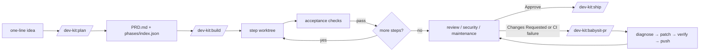
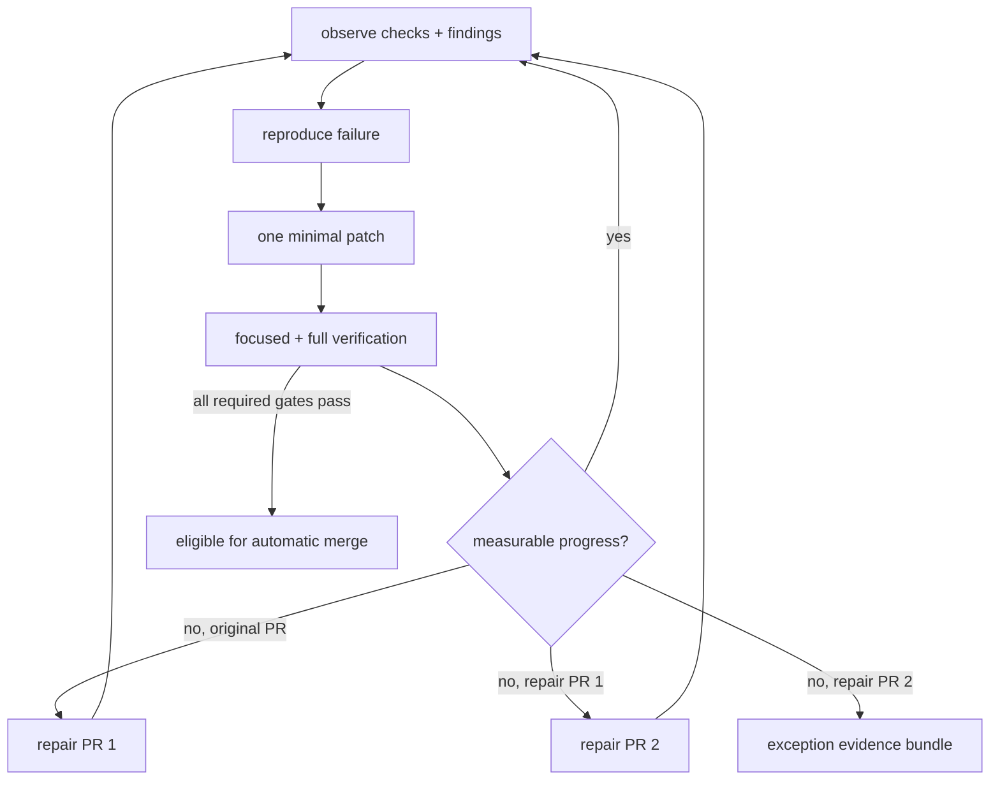
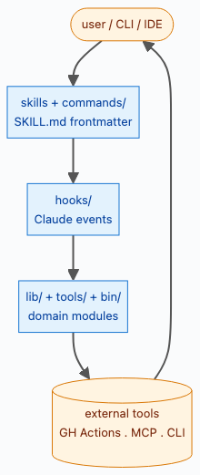
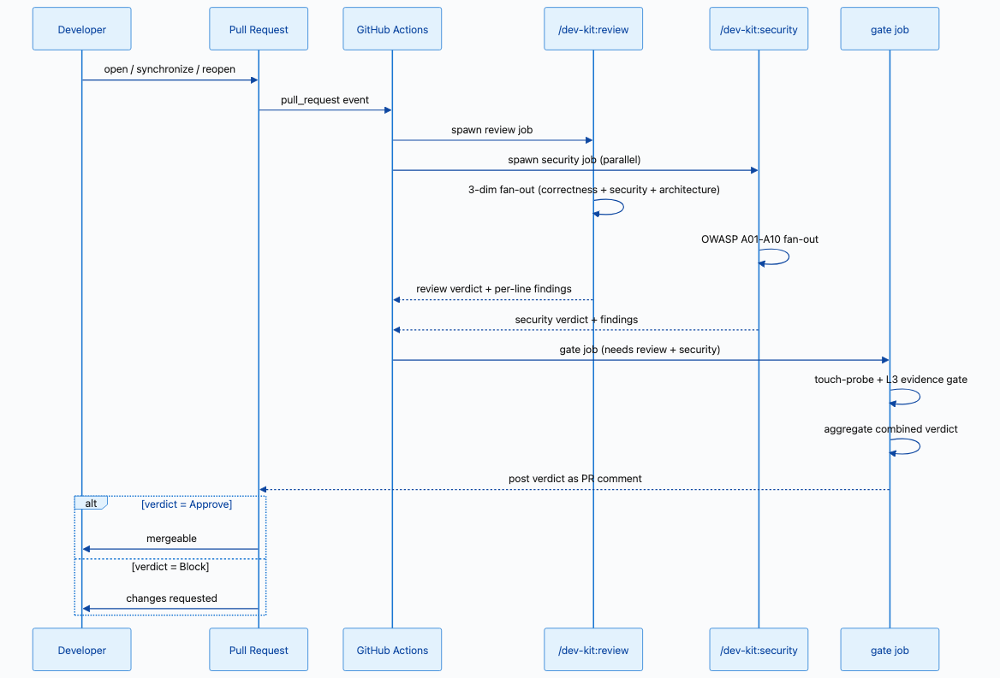
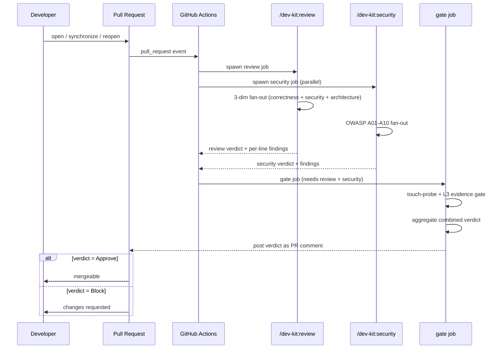

# dev-harness-kit

> A plugin that gives Claude Code and Codex a repeatable way to plan, build,
> review, and ship real code — with guardrails that the model can't talk its way
> around.

[](LICENSE)

**Language:** English · [한국어](README.ko.md)

---

## What is this?

`dev-harness-kit` installs one plugin — called `dev-kit` — into your project. Once
it's installed, you drive real development work through a handful of slash
commands that always follow the same loop:

```
bootstrap → plan → build → review → ship
```

Each step does one job. `plan` turns an idea into a written spec and a checklist
of build steps. `build` works through that checklist one step at a time, running
the tests as it goes. `review` and `ship` check the result and cut a release.

The important part is the guardrails. dev-kit installs **hooks** — small scripts
that run automatically on every file edit and shell command. They block things
like committing straight to `main`, editing files outside a working branch, or
claiming "done" without a passing test. These are enforced by code, not by
politely asking the model, so they hold even when the model would rather skip
them.

It works in both Claude Code and Codex, and the same commands mean the same thing
in both.

### Security scorecard

For a quick, repeatable repository metric, invoke `$security-metrics` from either
Claude Code or Codex. It calculates a deterministic 0–100 score for each OWASP
Top 10 area and writes a Markdown table with the evidence and deductions:

```bash
python3 skills/security-metrics/scripts/score_security.py . \
  --output security-metrics.md
```

The scorecard is a triage metric, not a certification. Use `/dev-kit:security`
for the full evidence-backed OWASP review before a release or major refactor.

**MCP integration is intentionally out of scope.** This plugin ships slash commands,
hooks, and library functions — no MCP server entry. See
[docs/decisions/0001-no-mcp.md](docs/decisions/0001-no-mcp.md) for the rationale.

**New here?** The friendliest starting point is
[`docs/home/00-index.md`](docs/home/00-index.md)
([한국어](docs/home/00-index.ko.md)) — it explains *why* the system exists and
walks a 60-second tour. This README covers install, the commands you'll use most,
and what to do when work doesn't go in a straight line.

---

## Install

The plugin supports both Claude Code and Codex. For Claude Code, **run every `claude plugin …` command on Node 22** —
the bundled CLI crashes on Node 25 and newer:

```bash
nvm install 22 && nvm use 22
```

Then install the plugin:

```bash
# Recommended: from the marketplace
claude plugin marketplace add sh-ai-x/dev-harness-kit
claude plugin install dev-kit

# …or from a local clone
git clone https://github.com/sh-ai-x/dev-harness-kit
claude plugin marketplace add ./dev-harness-kit
claude plugin install dev-kit

# At the start of each session
/reload-plugins
```

The install pins the `version` from `.claude-plugin/plugin.json` and keeps the
loaded copy in a version-named cache folder
(`~/.claude/plugins/cache/dev-kit/dev-kit/<version>/`). The marketplace tracks the
`main` branch, so a new version is available after each merge — see
[Keeping the plugin up to date](#keeping-the-plugin-up-to-date).

**Working on this repo itself?** Point Claude Code at your local checkout so your
edits are live with no re-install (this path also sidesteps the Node 25 bug):

```bash
claude --plugin-dir /path/to/dev-harness-kit
```

A handy alias for `~/.zshrc` or `~/.bashrc`:

```bash
alias claude-dev='claude --plugin-dir /path/to/dev-harness-kit'
```

> **Don't** symlink `~/.claude/skills/dev-kit` to the repo. A marketplace install
> and a skills-dir plugin with the same name collide, and the loader rejects the
> second copy. Use the alias above instead.

---

## Quickstart

On a brand-new repo, one command does all the first-time setup:

```bash
/dev-kit:bootstrap
```

This command now prompts you for ci-setup (the prompt defaults to Y; pass `--skip-ci` to decline or `--yes` to auto-accept). With Y, it writes three project files (`CLAUDE.md`, `AGENTS.md`, and the hook configuration) **and** installs the CI templates, in a single shot — matching the legacy `/dev-kit:bootstrap-full` behavior. Run `/dev-kit:bootstrap --skip-ci` or `/dev-kit:ci-setup --force` separately if you only want one half.

From there, the everyday loop is three commands:

```bash
/dev-kit:plan      # turn an idea into a written spec + a list of build steps
/dev-kit:build     # work through those steps one at a time, tests included
/dev-kit:review    # check the finished diff for correctness/security/design
```

What each one leaves behind, so you can see the progress on disk:

- **`/dev-kit:plan`** creates `PRD.md` (the spec) and a `phases/<name>/` folder
  holding one file per build step plus an `index.json` that tracks each step's
  status.
- **`/dev-kit:build`** works through those steps, writing code and running the
  acceptance checks, and marks each step `completed` in `index.json` as it goes.
- **`/dev-kit:review`** reads the diff and returns a verdict (Approve / Changes
  Requested / Blocked) with per-line findings.

When review is green, `/dev-kit:ship` cuts the release tag. That's the whole loop.

### Core workflow at a glance

The most important state transitions are intentionally small and resumable. The
full Code-Viz source record is [unified-repair-coordinator.md](docs/workflows/unified-repair-coordinator.md).



`plan` records intent and acceptance criteria before implementation. `build`
owns one step at a time and resumes from `index.json`. `babysit-pr` is the
single repair entrypoint: it watches CI and review, applies bounded fixes, and
rechecks the PR.



GitHub's `auto-fix-pr` is only an event adapter into the same repair state; it
is not a second user-facing workflow.

### Portability and long-running loop

The live contract is deliberately small:

```bash
python3 tools/portability_check.py --json
python3 tools/loop_engine.py iterate --feature-list feature_list.json
python3 tools/loop_engine.py verify --feature-list feature_list.json
```

The first command read-only checks Claude/Codex manifest and hook parity plus
shell syntax. The second deterministically selects one eligible failing feature,
runs its test, and atomically records `.dev-kit/loop-checkpoint.json`. It never
silently marks a feature complete: a green test is evidence, not approval.
The third command validates the checkpoint at cold-context resume. `ci-setup`
ships both CLIs to consumer repositories, so the loop is independent of the
plugin checkout path. See
[`PORTABILITY-AND-LOOP.md`](docs/architecture/PORTABILITY-AND-LOOP.md).

> A full "I have a brand-new repo" walkthrough (create repo → install → bootstrap
> → first commit) is at [First-time setup, end to end](#first-time-setup-end-to-end).

---

## Visualization: how workflows become diagrams

`/dev-kit:code-viz` walks the plugin and emits one self-contained HTML with
multi-level views (architecture → code → skill → hook → tools → external) plus a
per-skill workflow extraction. The patterns it uses are reusable — same approach
to render GH Actions pipelines, multi-phase repair loops, or any other
long-running process with discrete phases.

### Plugin at a glance

The full set of 6 abstraction levels is in `/tmp/code-viz.html` after a
code-viz run; the figures below are the ones worth a thumbnail — they
describe the mental model, the planning contract, the code-review lenses,
and the PR repair state machine.

| Diagram | What it shows |
|---|---|
| L0 Architecture | Layered topology — user → skills/commands → hooks → lib/tools/bin → external (GH Actions / MCP / CLI). |
| [`/dev-kit:plan` workflow](docs/skills/plan.md) | The 5-gate pipeline (frame → validate → non-goals → decompose → emit) with the ambiguity-loop back-edge from emit to frame. |
| [`/dev-kit:security` workflow](docs/skills/security.md) | OWASP Top-10 (A01–A10) parallel fan-out — the deep security lens of code review. |
| [`/dev-kit:babysit-pr` workflow](docs/skills/babysit-pr.md) | 15-step repair state machine; the dotted back-edge from `INCREMENT` to `SNAPSHOT` is the bounded-iteration loop that re-polls CI until verdicts flip green. |




> Regenerate locally with `python3 /tmp/cv.py --target=. --out=/tmp/code-viz.html --screenshots=docs/screenshots/code-viz --top-skills=20`. The PNG set is updated whenever a skill body, hook matrix, or workflow file changes; do not hand-edit the screenshots.

### GH Actions gate workflow

The shipped `review.yml` defines a PR → review/security fan-out → gate verdict
sequence. code-viz emits this as a `sequenceDiagram` (the same PNG that ships
with the visualizer):



The same shape renders cleanly on GitHub from a fenced ```mermaid``` block:



### Per-skill workflow extraction

For each user-invocable skill, code-viz tries five strategies in order — first
match wins — and falls back to the next only if the previous yields fewer than
two items:

1. **Domain-content sections** — `## Categories`, `## Dimensions`, `## Audit
   areas`, `## Checks` with bolded bullets (e.g. security's A01–A10, inspect's
   8 dimensions).
2. **`[N/M] LABEL → desc`** — used by `plan`'s 5-step framing.
3. **`## Gate N/M — label` / `## Phase N — label`** — numbered gates.
4. **Numbered list under `## Algorithm`** — used by `babysit-pr`'s 14-step
   repair loop.
5. **`## <SectionName>` headers** as implicit phases.

Skills without an extractable workflow are listed as text chips in a "no
workflow detected" section, never visualized as empty diagrams.

### Loop-back detection

Workflows that loop get a dotted, labeled back-edge — not just a straight
top-to-bottom chain:

- **Explicit** — a step's own text contains `goto N` (e.g. babysit-pr's step
  13 says "otherwise `goto 1`"). The back-edge points to the referenced step,
  labeled `retry -> step N`.
- **Implicit fallback** — no explicit goto, but the skill body uses recognized
  loop language (`3-cycle self-fix`, `repeat until`, `safety_valve` cap, …).
  The last step loops back to the first step, since "the process repeats" is
  the only sensible default.

A `python` fenced code block is stripped before the implicit-keyword scan — a
skill's own source code (including this one) can match the detector's pattern
strings as if they were prose describing a real loop.

### Edge semantics

Every edge in every diagram represents a real relationship — never a layout
artifact:

- **Sequential (chained arrows)** — used only where a real before/after
  relationship exists: per-skill workflow phases, hooks within one Claude
  event (they execute in declared array order).
- **Fan-out (no sibling edges)** — used for every pure inventory: `lib/`,
  `bin/`, `tools/` modules, directory listing, GitHub Actions workflows, MCP
  servers, third-party CLI invocations, and the domain pillar map. Root fans
  out to every item directly; no fabricated ordering between siblings that
  don't actually depend on each other.

Row grouping beyond 5 items renders as a borderless, fill-less subgraph with a
blank title — a layout aid, never a container. Consecutive inventory rows are
linked with Mermaid's invisible operator (`~~~`) to force vertical stacking
without implying an execution order.

---

## Most-used skills

There are many skills, but these are the ones you'll actually reach for. Every
slash command is `/dev-kit:<name>`. Each links to its detailed page.

### Setting up a project

| Command | What it does |
|---|---|
| [`/dev-kit:bootstrap`](docs/skills/bootstrap.md) | First entry on a fresh repo — writes `CLAUDE.md`, `AGENTS.md`, and the hook config. |
| [`/dev-kit:bootstrap (with ci-setup prompt)`](docs/skills/bootstrap.md) | `bootstrap` **and** `ci-setup` in one shot. The usual new-project starting point. |
| [`/dev-kit:ci-setup`](docs/skills/ci-setup.md) | Installs dev-kit's CI workflows and hooks into your repo so PRs run the same checks. |
| [`/dev-kit:ci-doctor`](docs/skills/ci-doctor.md) | Read-only check that answers "is my CI set up right — would the next PR pass?" |

### Planning and building

| Command | What it does |
|---|---|
| [`/dev-kit:plan`](docs/skills/plan.md) | Turns an idea into `PRD.md` + a step-by-step build checklist. |
| [`/dev-kit:build`](docs/skills/build.md) | Works through the checklist one step at a time, writing tests and code and verifying each step. |
| [`/dev-kit:build-debug`](docs/skills/build-debug.md) | 4-phase root-cause debugging (reproduce → isolate → root cause → fix). Standalone invocation hands the root cause to `/dev-kit:plan` instead of fixing inline. |
| [`/dev-kit:proposal`](docs/skills/proposal.md) | Renders a `docs/proposals/<main>/<sub>.yaml` to a self-contained HTML page with structured before/after + pros/cons/limitations for pre-impl review. |

### Getting a PR over the line

| Command | What it does |
|---|---|
| [`/dev-kit:babysit-pr`](docs/skills/babysit-pr.md) | Watches your open PR, fixes failing checks, pushes, and repeats until CI is green and review approves. Add `--local-verify` to gate iterations on a local test pass before pushing (saves GH-Actions minutes). |
| [`/dev-kit:pr-verify`](docs/skills/pr-verify.md) | Deterministic 5-gate PR verifier — fresh `gh` fetch per gate, catches the "stale CI" / "LLM-judge still running" false positive before any "ready to merge" claim. |
| [`/dev-kit:bump`](docs/skills/bump.md) | Explicit local `plugin.json` version bump + push of `chore/bump-vX.Y.Z` — race recovery and pre-PR explicit bumps. |
| [`/dev-kit:review-local`](commands/review-local.md) | Local equivalent of the GH-Actions review workflow. Runs `/dev-kit:review` + `/dev-kit:security` + `/dev-kit:maintenance` via local `claude -p`, with the same verdict extraction + combined gate + L3-evidence check + optional auto-approve. See [`docs/local-ci.md`](docs/local-ci.md) for the full playbook. |

### Keeping the project healthy

| Command | What it does |
|---|---|
| [`/dev-kit:inspect`](docs/skills/inspect.md) | Read-only whole-codebase health scan (dead code, duplication, smells) → one report. |
| [`/dev-kit:refactor`](docs/skills/refactor.md) | 3-phase cleanup chain — `inspect → build-refactor → review` with quoted exit codes between each gate. |
| [`/dev-kit:prune`](docs/skills/prune.md) | Slop-removal chain — `inspect → 3-pass delete sweep → review`. Reach for it when you want AI slop or dead features gone (not refactored). |
| [`/dev-kit:status`](docs/skills/status.md) | HOTL visualization — current loop progress, cumulative cycles, hand-off chain, and eval score on one screen. |
| [`/dev-kit:code-viz`](docs/skills/code-viz.md) | Generic plugin-architecture visualizer — multi-level views + domain pillar map + per-skill workflows to one self-contained HTML page. |
| [`/dev-kit:token-analyzer`](docs/skills/token-analyzer.md) | Shows where your Claude Code / Codex token spend is going, as an HTML dashboard. |
| [`/dev-kit:research`](docs/skills/research.md) | Every factual claim you write either cites a source or gets removed. |
| [`/dev-kit:docs-maintenance`](docs/skills/docs-maintenance.md) | Audits stale docs and refreshes the README without baking in facts that go out of date. |
| [`/dev-kit:ci-triage`](docs/skills/ci-triage.md) | Triages failing GitHub Actions runs across recent commits, deduplicates against a persisted case store, and judges each new failure against a model/context/harness taxonomy — every case must carry a re-runnable repro plus an executable regression test. |
| [`/dev-kit:log`](docs/skills/log.md) | Turns session logging on/off. It's what feeds `token-analyzer`, `skill-usage`, and the session monitor. |
| [`/dev-kit:skill-usage`](commands/skill-usage.md) | Shows which skills you actually use, and how much — useful for pruning. |
| [`/dev-kit:sot-harness-writer`](docs/skills/sot-harness-writer.md) | Interview-based Single Source of Truth harness document writer — 5 rounds × 2–3 evidence-backed recommendations, hands off to `/dev-kit:plan`. |
| [`/dev-kit:learn`](docs/skills/learn.md) | Distill source text (file, URL, prose, or session transcript) into a candidate `SKILL.md`, gated by deterministic G1–G5 checks + a per-candidate approval step. |

For the complete, always-current list of every skill (there are more than the
ones above), see [`docs/skills/README.md`](docs/skills/README.md). It's grouped by
category with a one-line summary each. You can also just type `/dev-kit:` and let
autocomplete show you what's available.

> **A note on skill names:** if a name doesn't show up in autocomplete, it's an
> internal helper the model runs on its own (like `build-tdd` inside `build`) —
> you type the parent command, not the helper. The plain rule: user-facing
> commands are the *verbs*; internal skills are the *machinery*.

---

## When the flow doesn't go straight through

Real work pauses, backtracks, and skips steps. Here's the short version of each
common case. The full, example-by-example walkthrough is in
[`docs/workflow/WORKFLOW-SCENARIOS.md`](docs/workflow/WORKFLOW-SCENARIOS.md).

**You got interrupted mid-build.** Just run `/dev-kit:build` again. Build tracks
each step's status in `phases/<name>/index.json` (`unimplemented → pending →
in_progress → completed`), and re-running always picks up from the first step
that isn't `completed`. Closing your laptop after step 2 means the next run starts
at step 3 — no flag, no re-planning.

**The plan turned out wrong while a step was in progress.** Run
[`/dev-kit:adapt`](commands/adapt.md). It pauses the in-flight step, shows you
exactly where the plan and the actual output disagree, proposes one small patch to
the spec/step file, and — only after you approve it — writes the patch and resumes
the build. Use this for a small correction; if the whole plan is wrong at the
root, re-run `/dev-kit:plan` instead.

**You came back on a different day or a different terminal** and lost your place.
Run `python3 tools/session_monitor.py`. It lists your recent sessions across the
repo's worktrees and hands you back the exact command to resume the right one.
(This needs `/dev-kit:log` to have been on — that's what records the sessions.)
See [Session monitor](#session-monitor) below for the flag reference.

**You want to skip the Valuate step.** Go ahead — the verdict is advisory.
`valuate` scores whether a plan is worth building, but the build stage proceeds
either way (the old hard gate was removed in PR #463). Note that as of PR #589
`valuate` is **model-invocable only** — `/dev-kit:plan` and other planning stages
call it; the slash no longer appears in the user menu. So "skipping" it just
means letting those stages run without an explicit verdict call. Skip on small
obvious work; rely on it as a sanity check on bigger bets.

**You want to skip straight to Build without a full plan.** There is **no
one-command bypass** today. Your honest options are to scope `/dev-kit:plan` very
tightly (it can emit a one- or two-step plan quickly) or to hand-seed a minimal
`phases/<name>/index.json` yourself. The [workflow scenarios
doc](docs/workflow/WORKFLOW-SCENARIOS.md#case-5-skipping-straight-to-build-without-a-full-plan)
explains both, and why the removed `tdd-fast` / `quick-fix` shortcuts are not an
option anymore.

---

## The worktree rule (please read)

This is the one hard rule that surprises newcomers, and it's enforced by a hook,
so you can't accidentally opt out.

> **Every task gets its own git worktree and branch.** You never edit files in the
> main checkout, and you never commit or push straight to `main`.

A worktree is just a second, isolated copy of your repo on a separate branch. The
plugin cuts one for you automatically when you start a new task in the main
checkout, or you can cut one yourself:

```bash
git worktree add -b feat/my-task .worktrees/feat-my-task origin/main
```

Then work inside that folder. If you try to edit the main checkout, the
`worktree-guard` hook blocks the edit and prints the list of live worktrees so you
can jump into one. The full rule (branch naming, the exact protocol, the hooks
that enforce it) lives in [`rules/git-workflow.md`](rules/git-workflow.md).

---

## Doc map

The repo ships ~20 topic docs across `docs/<topic>/`. The full categorized
table — HTML / MD / 한국어 sibling / what each doc gives you — lives in
[`docs/home/DOC-MAP.md`](docs/home/DOC-MAP.md).

**Start here:**

| If you want to … | Open |
|---|---|
| Learn the *why* in five minutes | [`docs/home/00-index.md`](docs/home/00-index.md) (sections 1–3) |
| Wire dev-kit into a new repo | [`docs/quality/ci-setup.md`](docs/quality/ci-setup.md) |
| See all stages in one place | [`docs/stages/STAGES.md`](docs/stages/STAGES.md) |
| Recover from a broken flow | [`docs/workflow/WORKFLOW-SCENARIOS.md`](docs/workflow/WORKFLOW-SCENARIOS.md) |
| Audit cost or back a factual claim | [`docs/observability/token-efficiency.md`](docs/observability/token-efficiency.md) |
| Pick up a session from a new shell | [`docs/observability/session-monitor.md`](docs/observability/session-monitor.md) |
| See what custom subagents this repo ships | [`docs/proposals/agent-architecture/multi-agent-design.md`](docs/proposals/agent-architecture/multi-agent-design.md) |

Everything else — HTML siblings, Korean docs, deep reference — is in
[`docs/home/DOC-MAP.md`](docs/home/DOC-MAP.md). If you have five minutes,
open [`docs/home/00-index.md`](docs/home/00-index.md) and read the first
three sections (why, quickstart, value). Everything else can wait.

---

## First-time setup, end to end

The complete "I have a brand-new repo" flow:

```bash
# 1. Create + clone
gh repo create myorg/myrepo --private --clone && cd myrepo

# 2. Install the plugin
claude plugin marketplace add sh-ai-x/dev-harness-kit
claude plugin install dev-kit
# (live source instead: claude --plugin-dir /path/to/dev-harness-kit)

# 3. One-shot setup: CLAUDE.md + AGENTS.md + hook config + CI templates
/dev-kit:bootstrap (with ci-setup prompt)

# 4. First commit + push
git add -A && git commit -m "chore: bootstrap dev-kit"
git push -u origin main
```

**Use `--force` on the very first install** (`/dev-kit:ci-setup --force`, which
`bootstrap` runs for you). On a fresh repo the result is identical to a
plain install, but `--force` is robust against a half-finished earlier attempt or
a stale plugin cache. You also re-run with `--force` later to pull updated
templates — see [Consumer CI install](#consumer-ci-install) for the details.

Typical next step: `/dev-kit:plan` to generate the spec and build steps.

---

## Keeping the plugin up to date

A marketplace install runs from a cached copy at
`~/.claude/plugins/cache/dev-kit/dev-kit/<version>/`. After a PR merges to `main`,
that cache is stale until you refresh it.

**Refresh when** a PR merged and you want the new behavior now, `/dev-kit:*`
output no longer matches the latest source, or a consumer repo's `ci-setup`
complains about a missing file.

**Claude Code** — the clean path works from any shell, including inside a Claude
Code session:

```bash
claude plugin update dev-kit
```

If that fails (usually the Node bug when run from inside a session), use the
escape-hatch script, which does the same job with plain `git pull` + `rsync`:

```bash
bin/devkit-refresh.sh
bin/devkit-refresh.sh --dry-run    # preview first
```

**Codex** — three refresh paths, in the order you should reach for them:

```bash
# 1. From inside a Codex session — slash menu. Refreshes the in-session
#    skill cache so /dev-kit:* picks up the new version immediately.
#    Type /skills, pick "Update".
/skills  →  Update

# 2. From any shell — CLI marketplace update. Refreshes the marketplace
#    clone of dev-kit (note: this can report "already up to date" while
#    the versioned plugin cache still holds stale files; if symptoms
#    persist, drop to #3).
codex plugin marketplace upgrade dev-kit

# 3. Escape hatch — does #2 PLUS an explicit rsync of the marketplace
#    checkout into the versioned cache directory. Useful when the CLI
#    is unavailable or you're inside a session where #2 reports success
#    but the cache is still stale.
bash skills/codex-cache-update/scripts/update.sh
bash skills/codex-cache-update/scripts/update.sh --dry-run    # preview first
```

Override the marketplace / cache paths the script targets (e.g. when the
auto-detected location is wrong):

```bash
CODEX_MARKETPLACE_DIR="/custom/path/to/marketplaces/dev-kit" \
CODEX_CACHE_ROOT="/custom/path/to/cache/dev-kit/dev-kit" \
bash skills/codex-cache-update/scripts/update.sh
```

**Live-source dev (recommended for contributors)** — sidestep the cache
entirely by pointing Codex at your local checkout. Edits are live with no
re-install:

```bash
codex --plugin-dir /path/to/dev-harness-kit
```

After any refresh, restart the client or run `/reload-plugins` where
supported.

---

## Consumer CI install

`/dev-kit:ci-setup` is what makes dev-kit's checks run in *your* repo. It copies in
the GitHub Actions workflows (ci, auto-fix-pr, review), the helper scripts
(validate, test, branch-policy, ci-local), a pre-push hook, and the worktree-rule
files. The shipped `review.yml` is self-aware — one file works whether the
checkout is the dev-kit plugin itself or a plain consumer repo.

`ci-setup` is **idempotent**: a marker file (`.dev-kit/ci-config.json`) records
what was installed, so a matching re-run does nothing. Use `--force` for a first
install, to pull a newly added/fixed template, or when you suspect a stale
install. Avoid `--force` on a clean re-run with no upstream changes, or if you've
hand-edited installed files — it overwrites local customizations, so review the
diff first.

```bash
bin/devkit-refresh.sh                                              # 1. refresh cache
cd /path/to/consumer-repo
/dev-kit:ci-setup --force                                          # 2. install
git diff .github/ scripts/ .githooks/ hooks/ .claude/ tests/       # 3. review
/dev-kit:ci-doctor                                                 # 4. verify (repeat to PASS)
git add -A && git commit -m "chore(ci): refresh dev-kit templates" # 5. commit
```

**Picking the CI review provider** is env-based, with no committed default, so
different operators can use different providers in the same repo. Locally, set
`CI_REVIEW_PROVIDER` in `.env` (managed via `bin/set-provider.sh <provider>`,
which is gitignored and per-user). In CI, set the GitHub repo variable
`vars.CI_REVIEW_PROVIDER` and the matching secret.

**Before your first PR — set these in GitHub:**

| Provider | Repo variable (provider picker) | Repo secret (API key) |
|---|---|---|
| `minimax` (default) | `CI_REVIEW_PROVIDER` | `MINIMAX_API_KEY` |
| `anthropic` | `CI_REVIEW_PROVIDER` | `ANTHROPIC_API_KEY` |
| `deepseek` | `CI_REVIEW_PROVIDER` | `DEEPSEEK_API_KEY` |

```bash
# 1. Pick the provider (variable -- visible to workflows).
gh variable set CI_REVIEW_PROVIDER --repo <owner>/<repo> --body minimax

# 2. Drop in the matching API key (secret -- masked in logs).
gh secret set MINIMAX_API_KEY --repo <owner>/<repo>

# 3. (Only if your fork of sh-ai-x/dev-harness-kit is private) — a PAT
#    scoped to that repo, so the action can pull the templates.
gh secret set DEV_KIT_GITHUB_TOKEN --repo <owner>/<repo> --app actions
```

Verify both are present and the provider is on the allowlist:

```bash
gh variable list --repo <owner>/<repo> | grep CI_REVIEW_PROVIDER
gh secret list --repo <owner>/<repo> | grep -E 'MINIMAX|ANTHROPIC|DEEPSEEK'
bin/set-provider.sh                          # local check: current provider + allowlist + switch hint
```

You can skip the manual `gh` calls by passing `--setup-secrets` to
`/dev-kit:ci-setup`: it reads `CI_REVIEW_PROVIDER`, enumerates the required
secrets via `required_secrets_for_provider()`, and prompts for each before
calling `gh secret set`. Install still succeeds if a secret-set fails — it's
surfaced as a warning, not an error.

Full detail and the Codex-side setup live in
[`docs/quality/ci-setup.md`](docs/quality/ci-setup.md).

**Linear PR sync (optional)** — `tools/linear_pr_sync.py` runs from
`.github/workflows/linear-pr-sync.yml` to keep the Linear issue tied to a PR
branch aligned with the PR lifecycle (In Progress → In Review → Done/Canceled).
It is non-blocking and drafts are skipped. Full state mapping in
[`docs/tools/LINEAR-PR-SYNC.md`](docs/tools/LINEAR-PR-SYNC.md).

---

## Tooling reference

### Session logging (`/dev-kit:log`)

Session logging is what powers the token analyzer, the skill-usage report, and
the session monitor — none of them have data until you turn it on.

```bash
/dev-kit:log setup   # scaffold logs/{claude-code,codex}/ and copy the log tool
/dev-kit:log on      # install the log hooks into this project's settings
/dev-kit:log status  # managed=N captured=N
/dev-kit:log off     # remove only dev-kit's log hooks; your own hooks survive
```

Captured transcripts land in `logs/<tool>/<branch>/<sid>.jsonl` and are
gitignored. See [`docs/skills/log.md`](docs/skills/log.md).

### Token efficiency + research

Two skills share the same thesis: **every claim must be backed or removed**.
`/dev-kit:token-analyzer` enforces that on **cost** — it replays your
`/dev-kit:log` transcripts into a self-contained HTML dashboard, scores
each session across 4 dimensions, flags 6 cost anti-patterns, and estimates
the USD savings. `/dev-kit:research` enforces that on **citations** — every
factual claim either carries `url + fetched_at + source_type` or is
prefixed `[UNCITED]` for the reviewer to fix. Both are read-only data
layers the model can't talk its way past.


Flags, the 4-dim scoring rubric, the 6 warning triggers, the pricing table,
and Phase 0 → 3 citation escalation are all in
[`docs/observability/token-efficiency.md`](docs/observability/token-efficiency.md).
The single-skill cards live at
[`docs/skills/token-analyzer.md`](docs/skills/token-analyzer.md) and
[`docs/skills/research.md`](docs/skills/research.md).

### Cost gate

A separate, **read-only** cost layer: `/dev-kit:cost-gate` prints the running
spend ledger on demand and emits the trailer block the PR aggregator needs. It
never blocks a tool call — it's observe-only. Thresholds, override env vars, and
the trailer format are in [`docs/skills/cost-gate.md`](docs/skills/cost-gate.md).

### Session monitor

`tools/session_monitor.py` finds a paused session and gets you back into it
— the answer to *"I closed my terminal, how do I return to that build?"*
The CLI form is genuinely CLI-friendly: a plain `--list` works from any
shell, the picker needs a real TTY, and `--print-resume-command` emits
the `cd <wt> && claude --resume <sid>` line for you to run with `!`.


```bash
python3 tools/session_monitor.py                       # interactive picker (real TTY)
python3 tools/session_monitor.py --list --days 30       # plain listing, any shell
python3 tools/session_monitor.py --json --days 30        # machine-readable
python3 tools/session_monitor.py --print-resume-command  # print the resume command and exit
python3 tools/session_monitor.py --cli-setup             # install a `session-monitor` shell alias
```

On Enter, the picker changes into the session's worktree and re-opens
the conversation (`claude --resume <sid>` or `codex resume <sid>`); if the
worktree is gone, it falls back to the main checkout with a warning.

Inside the picker, `/` enters live search: the buffer is a substring
pattern that re-narrows the row set on every keystroke. It composes on
top of `--filter`, so a CLI pass that already narrowed the set is
still the starting point.

| Key                              | Effect |
|----------------------------------|--------|
| `/` (or any printable char)      | enter live-search mode (buffer seeded with the printable) |
| Printable (incl. `q` / `Q` / `/`)| append to the buffer (literal — does not quit) |
| `Backspace` / `DEL`              | drop the last char |
| `Esc` (two-phase)                | first press clears the buffer; second exits search mode |
| `Enter` (matches)                | resume the highlighted session |
| `Enter` (zero matches)           | drop back to NORMAL (buffer kept) |
| `q` / `Q` / `Esc` / `Ctrl-C`     | quit the picker (NORMAL only) |
| `j` / `k` / `↑` / `↓`            | move cursor |

**LEARN MORE** — every flag, the status-glyph semantics, the picker
architecture (termios + ANSI, no curses), the full key table, and the
"why a tool alongside a skill" rationale live in
[`docs/observability/session-monitor.md`](docs/observability/session-monitor.md).
For the narrative of *when* you'd reach for it (resuming from a different
terminal or a different day), see
[workflow scenarios, Case 3](docs/workflow/WORKFLOW-SCENARIOS.md#case-3-coming-back-from-a-different-terminal-or-day).

### Skill usage (`/dev-kit:skill-usage`)

Per-skill telemetry over the same logged sessions: it shows how many turns each
skill drove and how many times you explicitly invoked it. High turns + low
invocations reads as a babysitter loop; both low means it's a prune candidate.

```bash
python3 tools/skill_usage.py                 # top skills, 30-day window
/dev-kit:skill-usage                         # same, through the command wrapper
python3 tools/skill_usage.py --top 0         # include skills with zero recent usage
python3 tools/skill_usage.py --cwd /path --days 7   # one workspace, fresh window
```

`--top 0` lists even unused skills — useful for a complete inventory. Don't read
zero captured usage as proof a skill is obsolete.

### Custom subagents (project-local)

`agents/*.md` and `agents/*.toml` are the repo's **first-class
extension points** for project-local subagents that Claude Code and Codex can
dispatch. These differ from the
global agent personas in `~/.claude/agents/` (built-in `backend-architect`,
`frontend-developer`, …) — they're scoped to one repo's tooling and ship
with the repo so every contributor gets the same auditing bot.

The shipped example is **`worktree-janitor`** — a read-only auditor over
`.worktrees/*` that classifies every worktree dir as
`live` / `merged` / `gone` / `fresh` / `unknown` (via
`tools/token_efficiency_analyzer.py:classify_all_worktrees()`) and reports
removal candidates for `live`/`unknown` only. It never runs
`git worktree remove` itself — the orchestrator reads its report and the
human runs the removal command. Adding a new project-local subagent:

1. For Claude Code, add `agents/<name>.md` with the standard frontmatter
   (`name:`, `description:`, `model:`, optional `tools:` allowlist).
   For Codex, add `agents/<name>.toml` with `name`, `description`, and
   `developer_instructions`; use `sandbox_mode = "read-only"` for auditors.
2. The lint gate `tests/test_agent_governance.py` enforces filename ==
   frontmatter `name:`, kebab-case, and a non-empty description
   (inline or block-scalar), plus the required Codex TOML fields.
3. Reuse the existing harness — `classify_all_worktrees`,
   `probe_working_tree_clean`, `classify_worktree_dir` are already exported
   for subagent consumption; do not re-implement in the agent file.

Proposal + dispatched-context contract for `worktree-janitor` (read by the
orchestrator that hands off batches to it) lives at
[`docs/proposals/agent-architecture/multi-agent-design.md`](docs/proposals/agent-architecture/multi-agent-design.md).
The Agent-tool hand-off contract (two envelopes — dispatch + report) is
documented in [`docs/architecture/multi-agent-orchestration-research.md`](docs/architecture/multi-agent-orchestration-research.md).

---

## Under the hood

Short pointers to the deeper material, so this README stays readable.

**The enforcement hooks** are the load-bearing part — deterministic guards that
short-circuit tool calls (block edits in the main checkout, deny destructive
`git`/`rm`, redact secrets, enforce test-first, require quoted exit codes before a
session ends). The skills are convenience wrappers around these hooks plus the
build state machine. The full hook inventory (by stage, and by the event that
fires each one) is in
[`docs/hooks/HOOK-REFERENCE.md`](docs/hooks/HOOK-REFERENCE.md); known coverage
gaps and per-runtime wiring differences are in
[`docs/hooks/hook-coverage-gaps.md`](docs/hooks/hook-coverage-gaps.md).

**What each stage reads and writes**, so you can see the data flow at a glance:

| Skill | Stage | Reads | Writes |
|---|---|---|---|
| `/dev-kit:plan` | Plan | Operator prompt | `PRD.md`, `phases/<name>/step<N>.md`, `phases/<name>/index.json` |
| `/dev-kit:valuate` (internal) | Valuate | `.dev-kit/hand-off/plan*.md` | `.dev-kit/valuations/<plan-id>.json` |
| `/dev-kit:build` | Build | `phases/<name>/index.json` + per-step file | per-step `output.json` |
| `/dev-kit:review` | Review | PR diff | verdict (Approve / Changes Requested / Blocked) |
| `/dev-kit:security` | Security | PR diff | per-OWASP verdict |
| `/dev-kit:ship` | Ship | Review verdict + AC outputs | `git tag` + CHANGELOG entry |

The verdict envelope `/dev-kit:valuate` writes (`decision` / `rationale` /
`blocking_findings`) is pinned by
`lib/valuation_engine.py:decision_is_canonical_envelope`. There used to be an
auto-gate that hard-blocked Build on a non-`proceed` verdict; it was removed in
PR #463 — see [Case 4 of the workflow scenarios doc](docs/workflow/WORKFLOW-SCENARIOS.md#case-4-skipping-the-valuate-step)
for what that means in practice.

**Agent-behavior eval** — `/dev-kit:evaluate` replays recorded transcripts and
judges them against per-dimension rubrics (review / security / plan) plus a
20-checkbox code-sanity checklist; adding `--harness-quality` or `--os-quality`
registers the matching cross-cutting rubric on the same runner. Details in
[`docs/skills/evaluate.md`](docs/skills/evaluate.md), with the rationale in
`docs/adr/ADR-0022-eval-agent-behavior.md`.

**Codex compatibility** — the same skills and hooks run under Codex CLI via a
`.codex-plugin/` manifest that mirrors the canonical hook config; a regression
test keeps the two in sync. Check local hook status with
`python3 bin/dev-kit-hooks-status.py`. Runtime portability is documented in
[`docs/architecture/RUNTIME-PORTABILITY.md`](docs/architecture/RUNTIME-PORTABILITY.md).

**Repository layout** — the directory-by-directory guide is the
[repository map](docs/repo/REPOSITORY-MAP.md).

**Design principles:**

- **NO-DUP** — Iron Laws live in one place (`iron-laws/index.md`), enforced by hook + skill. CLAUDE.md is a slim pointer document; detailed content lives in dedicated `index.md` files (iron-laws, guidelines, hooks, rules).
- **NO-BOTTLENECK** — 0-arg UX, slim pointer CLAUDE.md, parallel sub-agents.
- **NO-MEANINGLESS-LOOP** — explicit loop semantics + auto-STOP + user interrupt.
- **Human-on-the-Loop** — auto-progress with the user as supervisor and a 1× interrupt.
- **Methodology extension** — TDD / SDD / DDD / BDD / FDD selectable.
- **A2A typed** — sub-agent ↔ main communication via a JSON-Schema SSOT.
- **Plugin-only** — the plugin manifest is the single source of truth.
- **Worktree-per-task** — enforced by hooks, documented in `rules/git-workflow.md`.
- **Consumer-install** — one self-aware workflow set works in this repo and in consumer repos.

The full reasoning behind each of these lives in the ADR series under
[`docs/adr/`](docs/adr).

---

## Contributing

Pass the pre-impl gate ([`docs/planning/PRE-IMPL-CHECK.md`](docs/planning/PRE-IMPL-CHECK.md))
and the cost check ([`docs/quality/COST-ANALYSIS.md`](docs/quality/COST-ANALYSIS.md)),
then:

```bash
python3 -m pytest tests/ -q
claude plugin validate .claude-plugin/plugin.json
```

Reference docs: [`docs/stages/STAGES.md`](docs/stages/STAGES.md),
[`docs/naming/NAMING.md`](docs/naming/NAMING.md), [`CHANGELOG.md`](CHANGELOG.md),
and the shared rules under [`rules/`](rules).

## License

MIT
