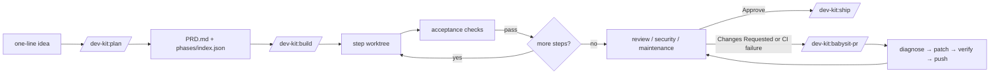
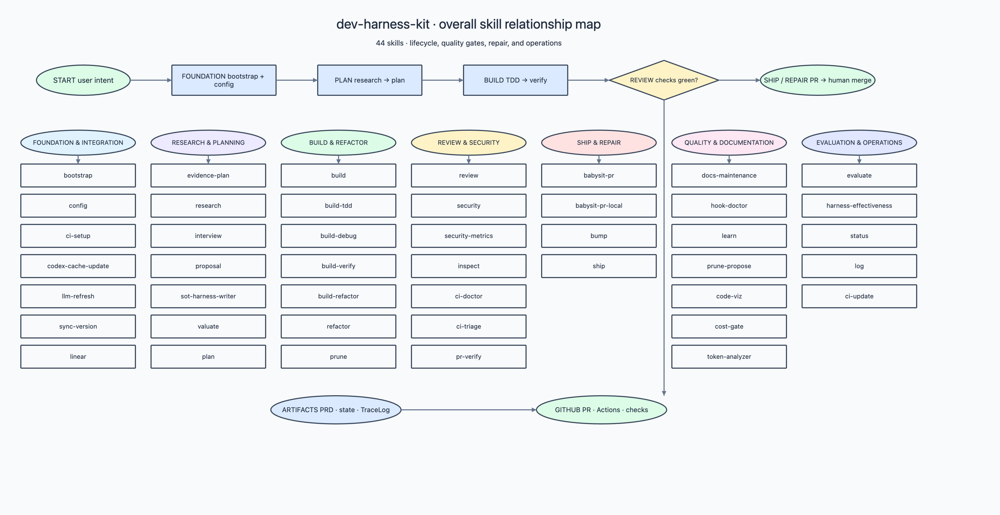

# dev-harness-kit

> A plugin that gives Claude Code and Codex a repeatable way to plan, build,
> review, and ship real code — with guardrails that the model can't talk its way
> around.

[](LICENSE)

**Language:** English · [한국어](README.ko.md)

---

## What is this?

`dev-harness-kit` installs one plugin — called `dev-kit` — into your project. Once
it's installed, you drive real development work through a handful of slash
commands that always follow the same loop:

```
bootstrap → evidence-plan? → plan → build → review → ship
```

Each step does one job: `plan` turns an idea into a written spec and a checklist
of build steps; `build` works through that checklist one step at a time with
tests as it goes; `review` and `ship` check the result and cut a release.
`evidence-plan` (optional) catches non-trivial ideas *before* the expensive
5-gate PRD runs — cited research, an HTML proposal you confirm, then a hand-off
into `plan`.

The important part is the **guardrails**. dev-kit installs hooks — small scripts
that run automatically on every file edit and shell command. They block things
like committing straight to `main`, editing files outside a working branch, or
claiming "done" without a passing test. These are enforced by code, not by
politely asking the model, so they hold even when the model would rather skip
them. It works in both Claude Code and Codex, and the same commands mean the
same thing in both.

**New here?** Start at [`docs/home/00-index.md`](docs/home/00-index.md) — it
walks a 60-second tour.

---

## Install

The plugin supports both Claude Code and Codex. For Claude Code, **run every `claude plugin …` command on Node 22** —
the bundled CLI crashes on Node 25 and newer:

```bash
nvm install 22 && nvm use 22
```

Then install the plugin:

```bash
# Recommended: from the marketplace
claude plugin marketplace add sh-ai-x/dev-harness-kit
claude plugin install dev-kit

# …or from a local clone
git clone https://github.com/sh-ai-x/dev-harness-kit
claude plugin marketplace add ./dev-harness-kit
claude plugin install dev-kit

# At the start of each session
/reload-plugins
```

The install pins the `version` from `.claude-plugin/plugin.json` and keeps the
loaded copy in a version-named cache folder
(`~/.claude/plugins/cache/dev-kit/dev-kit/<version>/`); the marketplace tracks
`main`, so a new version is available after each merge — see
[Keeping the plugin up to date](#keeping-the-plugin-up-to-date).

**Working on this repo itself?** Point Claude Code at your local checkout so your
edits are live with no re-install (also sidesteps the Node 25 bug):

```bash
claude --plugin-dir /path/to/dev-harness-kit
```

---

## Quickstart

On a brand-new repo, one command does all the first-time setup:

```bash
/dev-kit:bootstrap
```

This command now prompts you for ci-setup (the prompt defaults to Y; pass `--skip-ci` to decline or `--yes` to auto-accept). With Y, it writes three project files (`CLAUDE.md`, `AGENTS.md`, and the hook configuration) **and** installs the CI templates, in a single shot. Run `/dev-kit:bootstrap --skip-ci` or `/dev-kit:ci-setup --force` separately if you only want one half.

From there, the everyday loop is three commands:

```bash
/dev-kit:plan      # turn an idea into a written spec + a list of build steps
/dev-kit:build     # work through those steps one at a time, tests included
/dev-kit:review    # check the finished diff for correctness/security/design
```

What each one leaves behind, so you can see the progress on disk:

- **`/dev-kit:plan`** creates `PRD.md` and a `phases/<name>/` folder holding one
  file per build step plus an `index.json` that tracks each step's status.
- **`/dev-kit:build`** works through those steps, writing code and running the
  acceptance checks, and marks each step `completed` in `index.json` as it goes.
- **`/dev-kit:review`** reads the diff and returns a verdict (Approve / Changes
  Requested / Blocked) with per-line findings.

When review is green, `/dev-kit:ship` cuts the release tag. That's the whole loop.

### Core workflow at a glance

The most important state transitions are intentionally small and resumable. The
full repair state machine (and the per-step breakdown) lives in
[`docs/architecture/visualization.md`](docs/architecture/visualization.md#diagrams).



`plan` records intent and acceptance criteria before implementation. `build`
owns one step at a time and resumes from `index.json`. `babysit-pr` is the
single repair entrypoint: it watches CI and review, applies bounded fixes, and
rechecks the PR.

### Portability and long-running loop

Three commands pin the portable contract — Claude and Codex parity, the
deterministic loop engine, and a cold-context resume verifier. `ci-setup`
ships both CLIs to consumer repositories, so the loop is independent of the
plugin checkout path. See
[`docs/architecture/PORTABILITY-AND-LOOP.md`](docs/architecture/PORTABILITY-AND-LOOP.md).

> A full "I have a brand-new repo" walkthrough (create repo → install →
> bootstrap → first commit) is at
> [First-time setup, end to end](#first-time-setup-end-to-end).

---

## Visualization (overview)

`/dev-kit:code-viz` walks the plugin and emits one self-contained HTML with
multi-level views (architecture → code → skill → hook → tools → external) plus
a per-skill workflow extraction. The same approach renders GH Actions pipelines,
multi-phase repair loops, or any long-running process with discrete phases.

The map below inventories every skill shipped by this repository and groups
them by the role they play in the development harness. The live inventory lives
at [`docs/skills/README.md`](docs/skills/README.md); the per-skill Mermaid
diagrams, the GH Actions gate workflow, and the per-skill extraction +
loop-back + edge-semantics mechanics live in
[`docs/architecture/visualization.md`](docs/architecture/visualization.md).



Portable Archidraw scene data is alongside the image at
[`docs/architecture/2026-08-23/overall-skill-architecture.json`](docs/architecture/2026-08-23/overall-skill-architecture.json).
The [`babysit-pr` architecture reference](docs/architecture/2026-08-24/babysit-pr-architecture.md)
is a sibling doc — repair state machine, not a fixed number of commits.

---

## Most-used skills

There are many skills, but these are the ones you'll actually reach for. Every
slash command is `/dev-kit:<name>`. Each links to its detailed page.

### Setting up a project

| Command | What it does |
|---|---|
| [`/dev-kit:bootstrap`](docs/skills/bootstrap.md) | First entry on a fresh repo — writes `CLAUDE.md`, `AGENTS.md`, and the hook config. |
| [`/dev-kit:bootstrap` (with ci-setup prompt) | `bootstrap` **and** `ci-setup` in one shot — the usual new-project starting point. |
| [`/dev-kit:ci-setup`](docs/skills/ci-setup.md) | Installs dev-kit's CI workflows and hooks into your repo so PRs run the same checks. |
| [`/dev-kit:ci-doctor`](docs/skills/ci-doctor.md) | Read-only check: "is my CI set up right — would the next PR pass?" |

### Planning and building

| Command | What it does |
|---|---|
| [`/dev-kit:evidence-plan`](docs/skills/evidence-plan.md) | Front-door to a non-trivial idea — cited research, HTML proposal (you confirm), hand-off to `/dev-kit:plan`. Never invokes `/dev-kit:build`. |
| [`/dev-kit:plan`](docs/skills/plan.md) | Turns an idea into `PRD.md` + a step-by-step build checklist. |
| [`/dev-kit:build`](docs/skills/build.md) | Works through the checklist one step at a time, writing tests and code and verifying each step. |
| [`/dev-kit:build-debug`](docs/skills/build-debug.md) | 4-phase root-cause debugging (reproduce → isolate → root cause → fix). Standalone hands the root cause to `/dev-kit:plan`. |
| [`/dev-kit:proposal`](docs/skills/proposal.md) | Renders a `docs/proposals/<bucket>/<main>/<sub>.yaml` to a self-contained HTML page with before/after + pros/cons/limitations. |

### Getting a PR over the line

| Command | What it does |
|---|---|
| [`/dev-kit:babysit-pr`](docs/skills/babysit-pr.md) | Watches your open PR, fixes failing checks, pushes, repeats until CI is green and review approves. |
| [`/dev-kit:babysit-pr-local`](docs/skills/babysit-pr-local.md) | Same algorithm, but the LLM-judge verdict loop runs locally via `bin/review-local.sh` — use when GH-Actions minutes are exhausted. |
| [`/dev-kit:pr-verify`](docs/skills/pr-verify.md) | Deterministic 5-gate PR verifier — fresh `gh` fetch per gate, catches the "stale CI / LLM-judge still running" false positive. |
| [`/dev-kit:bump`](docs/skills/bump.md) | Explicit local `plugin.json` version bump + push of `chore/bump-vX.Y.Z` — race recovery and pre-PR explicit bumps. |
| [`/dev-kit:sync-version`](docs/skills/sync-version.md) | Inverse of `bump` — sync local `plugin.json:version` to `origin/main`. Same operation the pre-push hook runs automatically. |
| [`/dev-kit:maintenance`](docs/skills/maintenance.md) | Code-sanity gate (CC-1..8 / OE-1..8 / VM-1..4). Fires in `review.yml` and locally via `/dev-kit:review-local`; verdict maps `>=8.0` → Approve, `5.0..7.99` → Changes Requested, `<5.0` → Blocked. |
| [`/dev-kit:review-local`](commands/review-local.md) | Local equivalent of the GH-Actions review workflow — runs `/dev-kit:review` + `/dev-kit:security` + `/dev-kit:maintenance` via local `claude -p`. Full playbook in [`docs/local-ci.md`](docs/local-ci.md). |

### Keeping the project healthy

| Command | What it does |
|---|---|
| [`/dev-kit:inspect`](docs/skills/inspect.md) | Read-only whole-codebase health scan (dead code, duplication, smells) → one report. |
| [`/dev-kit:refactor`](docs/skills/refactor.md) | 3-phase cleanup chain — `inspect → build-refactor → review` with quoted exit codes between each gate. |
| [`/dev-kit:prune`](docs/skills/prune.md) | Slop-removal chain — `inspect → 3-pass delete sweep → review`. Reaches for AI slop or dead features (not refactored). |
| [`/dev-kit:status`](docs/skills/status.md) | HOTL visualization — current loop progress, cumulative cycles, hand-off chain, eval score on one screen. |
| [`/dev-kit:code-viz`](docs/skills/code-viz.md) | Generic plugin-architecture visualizer — multi-level views + domain pillar map + per-skill workflows to one self-contained HTML page. |
| [`/dev-kit:security-metrics`](docs/skills/security-metrics.md) | Deterministic 0–100 OWASP A01–A10 scorecard with Markdown evidence table. Triage metric before `/dev-kit:security`. |
| [`/dev-kit:token-analyzer`](docs/skills/token-analyzer.md) | Shows where your Claude Code / Codex token spend is going, as an HTML dashboard. |
| [`/dev-kit:cost-gate`](docs/skills/cost-gate.md) | Live session spend + two-line commit-trailer block. Read-only, never blocks. |
| [`/dev-kit:research`](docs/skills/research.md) | Every factual claim you write either cites a source or gets removed. |
| [`/dev-kit:docs-maintenance`](docs/skills/docs-maintenance.md) | Audits stale docs and refreshes the README without baking in facts that go out of date. |
| [`/dev-kit:ci-triage`](docs/skills/ci-triage.md) | Triages failing GitHub Actions runs across recent commits, deduplicates against a persisted case store. |
| [`/dev-kit:log`](docs/skills/log.md) | Turns session logging on/off — feeds `token-analyzer`, `skill-usage`, and the session monitor. |
| [`/dev-kit:skill-usage`](commands/skill-usage.md) | Shows which skills you actually use, and how much — useful for pruning. |
| [`/dev-kit:sot-harness-writer`](docs/skills/sot-harness-writer.md) | Interview-based Single Source of Truth harness document writer — hands off to `/dev-kit:plan`. |
| [`/dev-kit:evaluate`](docs/skills/evaluate.md) | LLM-judge eval across registered rubrics + the five-component harness-effectiveness report. Programmatic gate after any harness change. |
| [`/dev-kit:harness-effectiveness`](docs/skills/harness-effectiveness.md) | The five-component scorecard (prevention / first-pass / recovery / learning / measurement-integrity) standalone — sub-second, zero API spend. |
| [`/dev-kit:learn`](docs/skills/learn.md) | Distill source text (file, URL, prose, or transcript) into a candidate `SKILL.md`, gated by deterministic G1–G5 checks. |

For the complete list (grouped by category, one-line summary each), see
[`docs/skills/README.md`](docs/skills/README.md) — or just type `/dev-kit:` and
let autocomplete show you what's available. For the **metric / gate family**
(`evaluate`, `harness-effectiveness`, `maintenance`, `ci-doctor`, `security-metrics`)
and their relationships, see [`docs/observability/metrics.md`](docs/observability/metrics.md).

> A name that doesn't appear in autocomplete is an internal helper the model
> runs on its own (e.g. `build-tdd` inside `build`) — type the parent command.
> User-facing commands are the *verbs*; internal skills are the *machinery*.

---

## When the flow doesn't go straight through

Real work pauses, backtracks, and skips steps. Here's the short version of each
common case. The full, example-by-example walkthrough is in
[`docs/workflow/WORKFLOW-SCENARIOS.md`](docs/workflow/WORKFLOW-SCENARIOS.md).

**You got interrupted mid-build.** Just run `/dev-kit:build` again. Build tracks
each step's status in `phases/<name>/index.json` (`unimplemented → pending →
in_progress → completed`), and re-running always picks up from the first step
that isn't `completed`. Closing your laptop after step 2 means the next run starts
at step 3 — no flag, no re-planning.

**The plan turned out wrong while a step was in progress.** Run
[`/dev-kit:adapt`](commands/adapt.md). It pauses the in-flight step, shows you
exactly where the plan and the actual output disagree, proposes one small patch to
the spec/step file, and — only after you approve it — writes the patch and resumes
the build. Use this for a small correction; if the whole plan is wrong at the
root, re-run `/dev-kit:plan` instead.

**You came back on a different day or a different terminal** and lost your place.
Run `python3 tools/session_monitor.py`. It lists your recent sessions across the
repo's worktrees and hands you back the exact command to resume the right one.
(This needs `/dev-kit:log` to have been on — that's what records the sessions.)
See [Session monitor](#session-monitor) below for the flag reference.

**You want to skip the Valuate step.** Go ahead — the verdict is advisory.
`valuate` scores whether a plan is worth building, but the build stage proceeds
either way (the old hard gate was removed in PR #463). Note that as of PR #589
`valuate` is **model-invocable only** — `/dev-kit:plan` and other planning
stages call it; the slash no longer appears in the user menu. So "skipping" it
just means letting those stages run without an explicit verdict call. Skip on
small obvious work; rely on it as a sanity check on bigger bets.

**You want to skip straight to Build without a full plan.** There is **no
one-command bypass** today. Your honest options are to scope `/dev-kit:plan` very
tightly (it can emit a one- or two-step plan quickly) or to hand-seed a minimal
`phases/<name>/index.json` yourself. The [workflow scenarios
doc](docs/workflow/WORKFLOW-SCENARIOS.md#case-5-skipping-straight-to-build-without-a-full-plan)
explains both, and why the removed `tdd-fast` / `quick-fix` shortcuts are not an
option anymore.

---

## The worktree rule (please read)

This is the one hard rule that surprises newcomers, and it's enforced by a hook,
so you can't accidentally opt out.

> **Every task gets its own git worktree and branch.** You never edit files in the
> main checkout, and you never commit or push straight to `main`.

A worktree is just a second, isolated copy of your repo on a separate branch. The
plugin cuts one for you automatically when you start a new task in the main
checkout, or you can cut one yourself:

```bash
git worktree add -b feat/my-task .worktrees/feat-my-task origin/main
```

Then work inside that folder. If you try to edit the main checkout, the
`worktree-guard` hook blocks the edit and prints the list of live worktrees so you
can jump into one. The full rule (branch naming, the exact protocol, the hooks
that enforce it) lives in [`rules/git-workflow.md`](rules/git-workflow.md).

---

## Doc map

The repo ships ~20 topic docs across `docs/<topic>/`. The full categorized
table — HTML / MD / 한국어 sibling / what each doc gives you — lives in
[`docs/home/DOC-MAP.md`](docs/home/DOC-MAP.md).

**Start here:**

| If you want to … | Open |
|---|---|
| Learn the *why* in five minutes | [`docs/home/00-index.md`](docs/home/00-index.md) (sections 1–3) |
| Wire dev-kit into a new repo | [`docs/quality/ci-setup.md`](docs/quality/ci-setup.md) |
| See all stages in one place | [`docs/stages/STAGES.md`](docs/stages/STAGES.md) |
| Recover from a broken flow | [`docs/workflow/WORKFLOW-SCENARIOS.md`](docs/workflow/WORKFLOW-SCENARIOS.md) |
| Audit cost or back a factual claim | [`docs/observability/token-efficiency.md`](docs/observability/token-efficiency.md) |
| Pick up a session from a new shell | [`docs/observability/session-monitor.md`](docs/observability/session-monitor.md) |
| See what custom subagents this repo ships | [`docs/proposals/agent-architecture/multi-agent-design.md`](docs/proposals/agent-architecture/multi-agent-design.md) |

Everything else — HTML siblings, Korean docs, deep reference — is in
[`docs/home/DOC-MAP.md`](docs/home/DOC-MAP.md). If you have five minutes, open
[`docs/home/00-index.md`](docs/home/00-index.md) and read sections 1–3 (why,
quickstart, value). Everything else can wait.

---

## First-time setup, end to end

The complete "I have a brand-new repo" flow:

```bash
# 1. Create + clone
gh repo create myorg/myrepo --private --clone && cd myrepo

# 2. Install the plugin
claude plugin marketplace add sh-ai-x/dev-harness-kit
claude plugin install dev-kit
# (live source instead: claude --plugin-dir /path/to/dev-harness-kit)

# 3. One-shot setup: CLAUDE.md + AGENTS.md + hook config + CI templates
#    (also offers to set operator-global git defaults via
#     bin/setup-git-defaults.sh)
/dev-kit:bootstrap (with ci-setup prompt + git-defaults prompt)

# 4. First commit + push
git add -A && git commit -m "chore: bootstrap dev-kit"
git push -u origin main
```

**Use `--force` on the very first install** (`/dev-kit:ci-setup --force`, which
`bootstrap` runs for you). On a fresh repo the result is identical to a
plain install, but `--force` is robust against a half-finished earlier attempt
or a stale plugin cache. You also re-run with `--force` later to pull updated
templates — see [Consumer CI install](#consumer-ci-install).

Typical next step: `/dev-kit:plan` to generate the spec and build steps.

---

## Keeping the plugin up to date

A marketplace install runs from a cached copy at
`~/.claude/plugins/cache/dev-kit/dev-kit/<version>/`. After a PR merges to `main`,
that cache is stale until you refresh it.

**Refresh when** a PR merged and you want the new behavior now, `/dev-kit:*`
output no longer matches the latest source, or a consumer repo's `ci-setup`
complains about a missing file.

**Claude Code** — the clean path works from any shell, including inside a Claude
Code session:

```bash
claude plugin update dev-kit
```

If that fails (usually the Node bug when run from inside a session), use the
escape-hatch script, which does the same job with plain `git pull` + `rsync`:

```bash
bin/devkit-refresh.sh
bin/devkit-refresh.sh --dry-run    # preview first
```

**Codex** — three refresh paths, in the order you should reach for them:

```bash
# 1. From inside a Codex session — slash menu. Refreshes the in-session
#    skill cache so /dev-kit:* picks up the new version immediately.
/skills  →  Update

# 2. From any shell — CLI marketplace update. (May report "already up to
#    date" while the versioned cache is still stale; drop to #3.)
codex plugin marketplace upgrade dev-kit

# 3. Escape hatch — #2 PLUS an explicit rsync into the versioned cache.
bash skills/codex-cache-update/scripts/update.sh
bash skills/codex-cache-update/scripts/update.sh --dry-run    # preview
```

Override the auto-detected marketplace / cache paths when needed:

```bash
CODEX_MARKETPLACE_DIR="/custom/path/to/marketplaces/dev-kit" \
CODEX_CACHE_ROOT="/custom/path/to/cache/dev-kit/dev-kit" \
bash skills/codex-cache-update/scripts/update.sh
```

**Live-source dev (recommended for contributors)** — sidestep the cache
entirely:

```bash
codex --plugin-dir /path/to/dev-harness-kit
```

After any refresh, restart the client or run `/reload-plugins` where supported.

---

## Consumer CI install

`/dev-kit:ci-setup` is what makes dev-kit's checks run in *your* repo. It copies in
the GitHub Actions workflows (ci, auto-fix-pr, review), the helper scripts
(validate, test, branch-policy, ci-local), a pre-push hook, and the worktree-rule
files. The shipped `review.yml` is self-aware — one file works whether the
checkout is the dev-kit plugin itself or a plain consumer repo.

`ci-setup` is **idempotent**: a marker file (`.dev-kit/ci-config.json`) records
what was installed, so a matching re-run does nothing. Use `--force` for a first
install, to pull a newly added/fixed template, or when you suspect a stale
install. Avoid `--force` on a clean re-run with no upstream changes, or if you've
hand-edited installed files — it overwrites local customizations, so review the
diff first.

When dev-kit ships new or fixed templates after your initial install, reach for
[`/dev-kit:ci-update`](docs/skills/ci-update.md) instead of `--force` — it
classifies each shipped file as `new` / `updated` / `consumer_modified` /
`diverged` (plus `unchanged`), with backup-before-overwrite and no destructive
blind-apply. Full contract in [`docs/quality/ci-update.md`](docs/quality/ci-update.md).

```bash
bin/devkit-refresh.sh                                              # 1. refresh cache
cd /path/to/consumer-repo
/dev-kit:ci-setup --force                                          # 2. install
git diff .github/ scripts/ .githooks/ hooks/ .claude/ tests/       # 3. review
/dev-kit:ci-doctor                                                 # 4. verify (repeat to PASS)
git add -A && git commit -m "chore(ci): refresh dev-kit templates" # 5. commit
```

**Picking the CI review provider** is env-based, with no committed default, so
different operators can use different providers in the same repo. Locally, set
`CI_REVIEW_PROVIDER` in `.env` (managed via `bin/set-provider.sh <provider>`,
gitignored and per-user). In CI, set the GitHub repo variable
`vars.CI_REVIEW_PROVIDER` and the matching secret.

**Before your first PR — set these in GitHub:**

| Provider | Repo variable (provider picker) | Repo secret (API key) |
|---|---|---|
| `minimax` (default) | `CI_REVIEW_PROVIDER` | `MINIMAX_API_KEY` |
| `anthropic` | `CI_REVIEW_PROVIDER` | `ANTHROPIC_API_KEY` |
| `deepseek` | `CI_REVIEW_PROVIDER` | `DEEPSEEK_API_KEY` |

```bash
# 1. Pick the provider (variable -- visible to workflows).
gh variable set CI_REVIEW_PROVIDER --repo <owner>/<repo> --body minimax

# 2. Drop in the matching API key (secret -- masked in logs).
gh secret set MINIMAX_API_KEY --repo <owner>/<repo>

# 3. (Only if your fork of sh-ai-x/dev-harness-kit is private) — a PAT
#    scoped to that repo, so the action can pull the templates.
gh secret set DEV_KIT_GITHUB_TOKEN --repo <owner>/<repo> --app actions
```

Verify both are present and the provider is on the allowlist:

```bash
gh variable list --repo <owner>/<repo> | grep CI_REVIEW_PROVIDER
gh secret list --repo <owner>/<repo> | grep -E 'MINIMAX|ANTHROPIC|DEEPSEEK'
bin/set-provider.sh                          # local check: current provider + allowlist + switch hint
```

You can skip the manual `gh` calls by passing `--setup-secrets` to
`/dev-kit:ci-setup`: it reads `CI_REVIEW_PROVIDER`, enumerates the required
secrets via `required_secrets_for_provider()`, and prompts for each before
calling `gh secret set`. Install still succeeds if a secret-set fails — it's
surfaced as a warning, not an error.

Full detail and the Codex-side setup live in
[`docs/quality/ci-setup.md`](docs/quality/ci-setup.md).

**Linear PR sync (optional)** — `tools/linear_pr_sync.py` (run from
`.github/workflows/linear-pr-sync.yml`) keeps the Linear issue aligned with the
PR lifecycle (In Progress → In Review → Done/Canceled). Non-blocking, drafts
skipped. State mapping in [`docs/tools/LINEAR-PR-SYNC.md`](docs/tools/LINEAR-PR-SYNC.md).

---

## Under the hood

Short pointers to the deeper material, so this README stays readable.

**The enforcement hooks** are the load-bearing part — deterministic guards that
short-circuit tool calls (block edits in the main checkout, deny destructive
`git`/`rm`, redact secrets, enforce test-first, require quoted exit codes before a
session ends). Full inventory in [`docs/hooks/HOOK-REFERENCE.md`](docs/hooks/HOOK-REFERENCE.md);
per-runtime wiring gaps in [`docs/hooks/hook-coverage-gaps.md`](docs/hooks/hook-coverage-gaps.md).

**Stage I/O** — what each stage reads and writes: [`docs/stages/STAGES.md`](docs/stages/STAGES.md)
is the canonical table. The verdict envelope `/dev-kit:valuate` writes
(`decision` / `rationale` / `blocking_findings`) is pinned by
`lib/valuation_engine.py:decision_is_canonical_envelope`; the old hard gate that
blocked Build on a non-`proceed` verdict was removed in PR #463.

**Eval layer** — `/dev-kit:evaluate` keeps the existing transcript/rubric
evaluation and adds a workflow-native harness-effectiveness report (five
components: prevention, first-pass, recovery, learning, measurement integrity).
Missing evidence is reported explicitly rather than inferred. Details in
[`docs/skills/evaluate.md`](docs/skills/evaluate.md), rationale in
`docs/adr/ADR-0022-eval-agent-behavior.md`.

**Codex compatibility** — the same skills and hooks run under Codex CLI via a
`.codex-plugin/` manifest that mirrors the canonical hook config; a regression
test keeps the two in sync. Check local hook status with
`python3 bin/dev-kit-hooks-status.py`. Runtime portability is documented in
[`docs/architecture/RUNTIME-PORTABILITY.md`](docs/architecture/RUNTIME-PORTABILITY.md).

**Repository layout** — the directory-by-directory guide is the
[repository map](docs/repo/REPOSITORY-MAP.md). **MCP integration is intentionally out of scope** — slash commands, hooks, and library functions only; rationale in
[docs/decisions/0001-no-mcp.md](docs/decisions/0001-no-mcp.md).

**Design principles:** NO-DUP (Iron Laws in one place, CLAUDE.md is a slim
pointer), NO-BOTTLENECK (0-arg UX, parallel sub-agents), NO-MEANINGLESS-LOOP
(explicit loop semantics + auto-STOP + user interrupt), Human-on-the-Loop
(user as supervisor with a 1× interrupt), Methodology extension (TDD / SDD /
DDD / BDD / FDD selectable), A2A typed (sub-agent ↔ main via JSON-Schema SSOT),
Plugin-only (the plugin manifest is the single source of truth),
Worktree-per-task (enforced by hooks), and Consumer-install (one self-aware
workflow set works in this repo and in consumer repos). Full reasoning in the
ADR series under [`docs/adr/`](docs/adr).

---

## Security scorecard

For a quick, repeatable repository metric, invoke `/dev-kit:security-metrics`
(or the `$security-metrics` model-invoked helper) from either Claude Code or
Codex. It walks the repo with only `Read` / `Grep` / `Glob` / `Bash` (no
external scanner, no network calls), produces a deterministic **0–100 score for
each OWASP Top 10 (A01–A10) area**, and writes a Markdown report containing the
score, the evidence rule that fired, and the deduction behind it:

```bash
python3 skills/security-metrics/scripts/score_security.py . \
  --output security-metrics.md
```

**Scoring contract** (pinned by `skills/security-metrics/SKILL.md`):

- Every category starts at 100 and applies only deterministic, source-tree-only
  deductions.
- The overall score is the arithmetic mean of the ten category scores,
  rounded to the nearest integer.
- Each check reports exactly one of two statuses: `PASS` (no rule fired) or
  `REVIEW` (one or more rules fired). Deductions are never suppressed; if a
  rule is a false positive, the scorer records the reason in the report for a
  follow-up.
- The skill is `Read`-only: it never installs dependencies, never calls an
  external scanner, never modifies the working tree.

The scorecard is a **triage metric, not a certification**. Use `/dev-kit:security`
for the full evidence-backed OWASP review before a release or major refactor.
Full scoring details, rules per category, and limitation list live in
[`docs/skills/security-metrics.md`](docs/skills/security-metrics.md).

---

## Contributing

Pass the pre-impl gate ([`docs/planning/PRE-IMPL-CHECK.md`](docs/planning/PRE-IMPL-CHECK.md))
and the cost check ([`docs/quality/COST-ANALYSIS.md`](docs/quality/COST-ANALYSIS.md)),
then:

```bash
python3 -m pytest tests/ -q
claude plugin validate .claude-plugin/plugin.json
```

Reference docs: [`docs/stages/STAGES.md`](docs/stages/STAGES.md),
[`docs/naming/NAMING.md`](docs/naming/NAMING.md), [`CHANGELOG.md`](CHANGELOG.md),
and the shared rules under [`rules/`](rules).
## License

MIT
