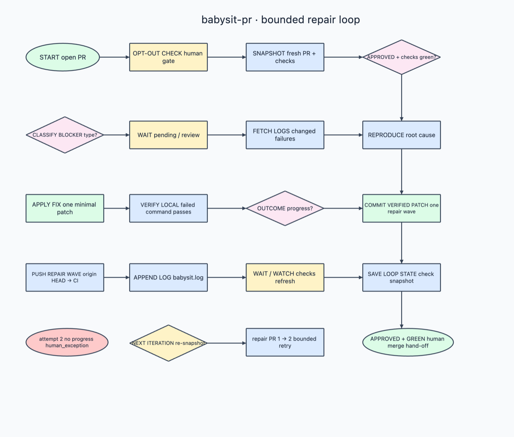

# babysit-pr Architecture

This is the dedicated `babysit-pr Architecture` tab exported from the
Archidraw MCP canvas. It documents the repair coordinator as a bounded,
evidence-driven loop; it is not a workflow with a fixed number of commits.

## Reading the diagram

The flow starts with the operator and the target PR, then moves through the
following gates:

1. **Opt-out and human gate** — the single-operator bypass is checked first;
   ordinary runs keep approval as a human-controlled decision.
2. **Snapshot and terminate** — the current PR, review verdict, checks, and
   durable loop state are read together. An approved PR with only successful,
   skipped, or neutral checks terminates successfully.
3. **Classify and wait** — blockers are separated into failed checks, pending
   checks, requested changes, or missing approval. Pending checks wait instead
   of being treated as failures.
4. **Fetch logs and diagnose** — changed failing checks are investigated from
   their failed-run logs, with one root cause selected per check.
5. **Apply and verify** — one logical fix is applied and the same failing
   command is run locally. Verification is a hard gate: an unverified change
   is not pushed.
6. **Persist outcome** — progress and recovery state are saved after
   verification so a worker restart does not lose the current phase.
7. **Commit, push, log, and re-check** — the verified repair wave is committed
   with specific paths, pushed, logged, and observed through the next CI/review
   snapshot.
8. **Bounded retry or human hand-off** — the loop increments its watchdog
   counter and retries only within `MAX_ITERS`. Approval, ownership, merge, and
   unresolved recovery remain human decisions.

The diagram therefore shows a repair loop, not “9 commits” or “10 commits.”
The number of commits depends on how many verified repair waves are actually
needed; `babysit-pr` never auto-merges a PR.

## Source of truth

- [`skills/babysit-pr/SKILL.md`](../../../../skills/babysit-pr/SKILL.md) — runtime contract and 14-step algorithm.
- [`canonical-wiring.md`](../../../../skills/babysit-pr/recipes/canonical-wiring.md) — command and state wiring details.
- [`babysit-pr` workflow reference](../../skills/babysit-pr.md) — user-facing workflow documentation.

The PNG is a committed Archidraw MCP export. Update the export and this
explanation together when the workflow’s control flow changes.
