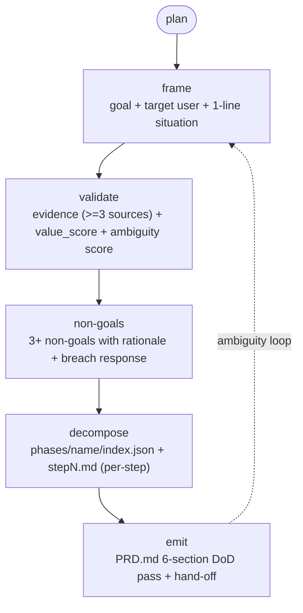
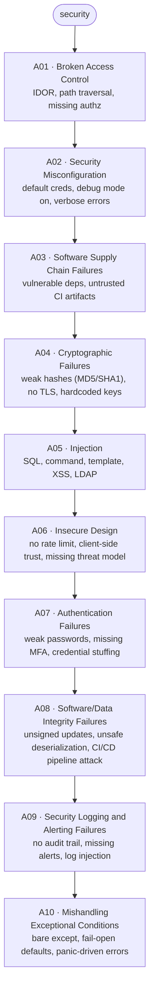
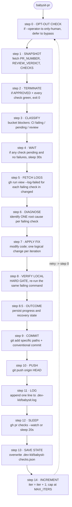
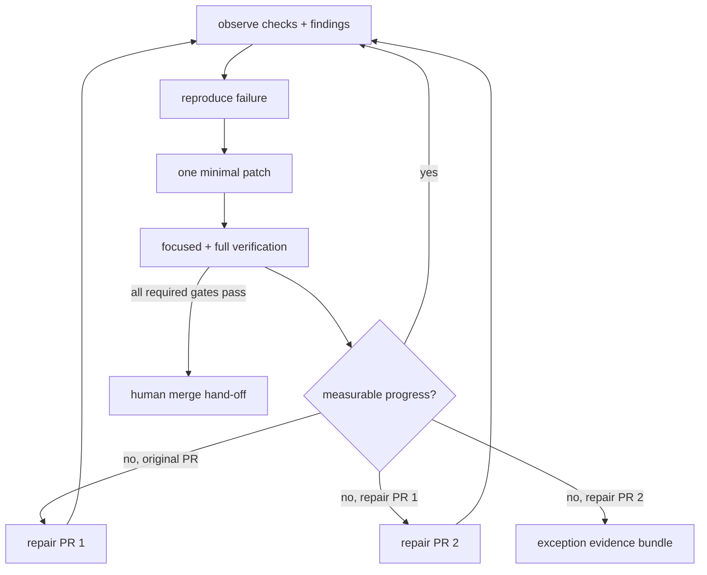
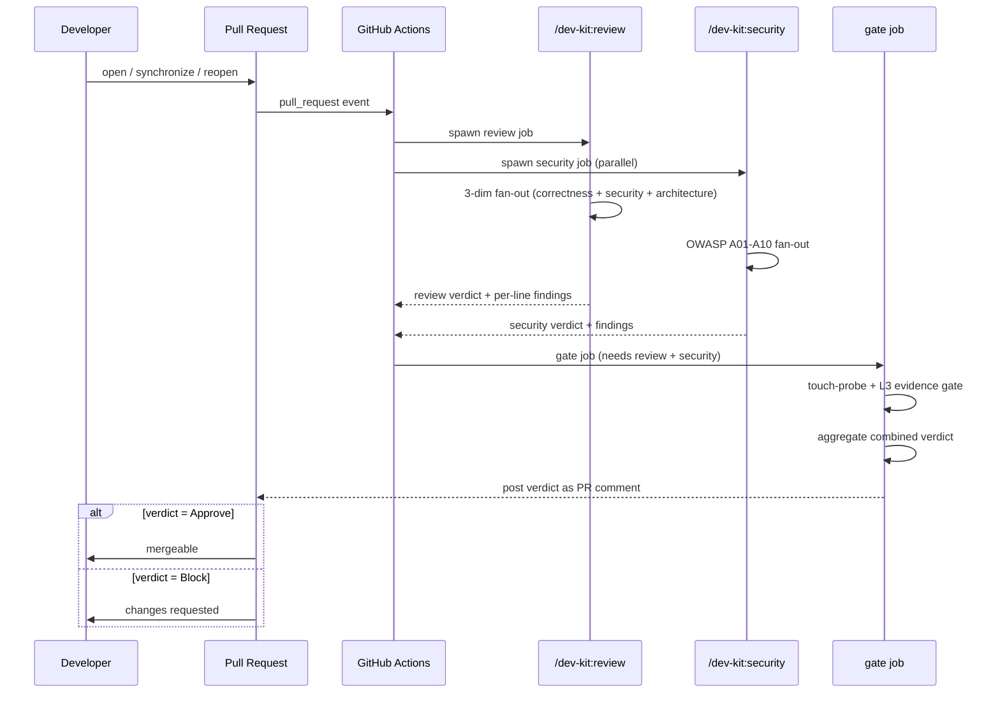

# Visualization — how workflows become diagrams

`/dev-kit:code-viz` walks the plugin and emits one self-contained HTML with
multi-level views (architecture → code → skill → hook → tools → external) plus
a per-skill workflow extraction. The patterns it uses are reusable — same
approach to render GH Actions pipelines, multi-phase repair loops, or any
other long-running process with discrete phases.

This document is the full reference for the diagrams emitted by `code-viz` and
the rules the extractor follows. Use it when you want to author a new
per-skill workflow, audit how a diagram was assembled, or extend `code-viz`
to a new plugin.

## Diagrams

The four Mermaid blocks below are the compact, source-backed examples. The
generated HTML remains the canonical interactive view for the full
architecture → code → skill → hook → tools → external levels and per-skill
workflow extraction.

### `/dev-kit:plan` — 5 gates with ambiguity loop

The plan skill walks an idea through five gates before emitting a PRD.
The dotted back-edge from `emit` to `frame` is the ambiguity loop: when the
emitted PRD fails its own acceptance criteria, the workflow re-enters at
`frame` for one more pass.



### `/dev-kit:security` — OWASP Top-10 (A01–A10)

Eleven parallel subagents, one per OWASP 2025 category, return
evidence-backed findings; a verification pass confirms or rejects each
before a per-category breakdown table + verdict.



### `/dev-kit:babysit-pr` — bounded repair loop with retry back-edge

The 14-step repair state machine with its pre-loop opt-out check and an
outcome checkpoint. The dotted back-edge from `INCREMENT` to `OPT-OUT CHECK`
is the bounded-iteration loop that re-polls CI until verdicts flip green.



### Repair state machine — observation → patch → verify → push

The general repair state machine: observe, reproduce, patch, verify, then
either progress or escalate through bounded repair PRs before handing off
to a human merge. GitHub's `auto-fix-pr` is only an event adapter into this
same repair state; it is not a second user-facing workflow.



## GH Actions gate workflow

The shipped `review.yml` defines a PR → review/security fan-out → gate verdict
sequence. code-viz emits this as a `sequenceDiagram`; it renders inline
directly from a fenced ```mermaid``` block:



## What the visualizer ships

The diagrams above are the same shapes `code-viz` emits. The HTML
output it writes to `/tmp/code-viz.html` is the multi-level view that
folds all 6 abstraction levels + the GH Actions gate into a single
self-contained page. The screenshot below is the L0 architecture
overview rendered from that HTML — what `/dev-kit:code-viz` looks
like in a browser:


> Regenerate the code-viz image by running `/dev-kit:code-viz --screenshots=docs/screenshots/code-viz --top-skills=20` (the generator is the script embedded in `skills/code-viz/SKILL.md`). The code-viz L0 image and the separately authored Archidraw Overall Skill Map are both committed exports; update each from its own source when the corresponding architecture changes. The per-skill workflows render inline as `mermaid` blocks and need no PNG export.

## Per-skill workflow extraction

For each user-invocable skill, code-viz tries five strategies in order — first
match wins — and falls back to the next only if the previous yields fewer than
two items:

1. **Domain-content sections** — `## Categories`, `## Dimensions`, `## Audit
   areas`, `## Checks` with bolded bullets (e.g. security's A01–A10, inspect's
   8 dimensions).
2. **`[N/M] LABEL → desc`** — used by `plan`'s 5-step framing.
3. **`## Gate N/M — label` / `## Phase N — label`** — numbered gates.
4. **Numbered list under `## Algorithm`** — used by `babysit-pr`'s 14-step
   repair loop, plus its explicit pre-loop and outcome checkpoint.
5. **`## <SectionName>` headers** as implicit phases.

Skills without an extractable workflow are listed as text chips in a "no
workflow detected" section, never visualized as empty diagrams.

## Loop-back detection

Workflows that loop get a dotted, labeled back-edge — not just a straight
top-to-bottom chain:

- **Explicit** — a step's own text contains `goto N` (e.g. babysit-pr's step
  13 says "otherwise `goto 1`"). The back-edge points to the referenced step,
  labeled `retry -> step N`.
- **Implicit fallback** — no explicit goto, but the skill body uses recognized
  loop language (`3-cycle self-fix`, `repeat until`, `safety_valve` cap, …).
  The last step loops back to the first step, since "the process repeats" is
  the only sensible default.

A `python` fenced code block is stripped before the implicit-keyword scan — a
skill's own source code (including this one) can match the detector's pattern
strings as if they were prose describing a real loop.

## Edge semantics

Every edge in every diagram represents a real relationship — never a layout
artifact:

- **Sequential (chained arrows)** — used only where a real before/after
  relationship exists: per-skill workflow phases, hooks within one Claude
  event (they execute in declared array order).
- **Fan-out (no sibling edges)** — used for every pure inventory: `lib/`,
  `bin/`, `tools/` modules, directory listing, GitHub Actions workflows, MCP
  servers, third-party CLI invocations, and the domain pillar map. Root fans
  out to every item directly; no fabricated ordering between siblings that
  don't actually depend on each other.

Row grouping beyond 5 items renders as a borderless, fill-less subgraph with a
blank title — a layout aid, never a container. Consecutive inventory rows are
linked with Mermaid's invisible operator (`~~~`) to force vertical stacking
without implying an execution order.

---

For the live contract (frontmatter fields, generator invocation, and how the
visualizer handles new skill types), see
[`docs/skills/code-viz.md`](../skills/code-viz.md).
