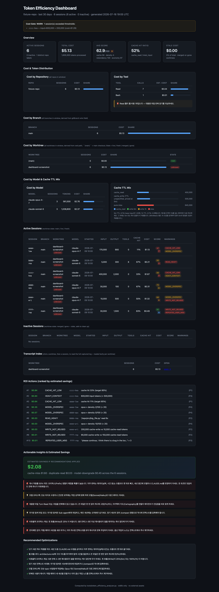

# Token efficiency + research

Two skills share the same thesis: **every claim must be backed or removed**.
One enforces that rule on **cost** (`/dev-kit:token-analyzer`), the other on
**citations** (`/dev-kit:research`). Both ship read-only data layers that
the model cannot talk its way past — their dashboards are deterministic
replays of either `/dev-kit:log` transcripts (for cost) or `lib/research_engine.py`
fan-out (for citations).

This doc walks through both. The 60-second version lives in the README;
this is the long form.

---

## `/dev-kit:token-analyzer`

**Category:** `audit` · **Alpha:** `analysis` · **Invocation:** `/dev-kit:token-analyzer [--repo NAME] [--days N]` (human-invoked)

`token-analyzer` turns the JSONL session transcripts captured by `/dev-kit:log`
into a per-repository, last-N-days token-efficiency dashboard: 4-dimension
session scoring, 6 anti-pattern warnings, and a USD savings estimate.

It is its own skill rather than an `--html` flag on `/dev-kit:log` because
`/dev-kit:log` only toggles transcript capture (on/off/status/setup) while
this skill *consumes* those transcripts — capture and analysis are different
pipeline stages that deserve distinct slash commands.

### How it works

1. Confirm transcripts exist under `logs/claude-code/<branch>/` and/or
   `logs/codex/<branch>/` (a recursive walk; legacy flat files at the top
   level are also picked up and bucketed under branch `main`). If neither
   location has transcripts, the skill points the user at
   `/dev-kit:log setup` + `/dev-kit:log on` instead of running.
2. Detect the repo name from the most common `cwd` basename across captured
   sessions, or accept `--repo <name>` to override; if the user did not pass
   `--repo`, the skill confirms the derived name with the user before
   running.
3. Invoke `tools/token_efficiency_analyzer.py --repo <name> --days 30` and
   capture its `[ok] sessions=N files_scanned=M total_cost=$... estimated_savings=$...`
   summary line.
4. Echo the summary plus the output HTML path to the user, resolved and
   printed as a **relative**, `./`-prefixed path (never an absolute
   `/Users/...` path, since the user may be on a different machine, worktree,
   or symlinked mount).

The skill itself is read-only (`disallowed-tools: Write Edit`); the Python
CLI writes the file directly, mirroring how the rest of the dev-kit
audit/inspect skills keep their skill body pure and let the driver own I/O.
Example emitted lines:

```
[ok] sessions=14  files_scanned=14  total_cost=$1.23  estimated_savings=$0.01  stale_cost=$0.00  transcripts=14
Open: ./docs/observability/dashboard-dev-harness-kit-30d.html
```

### Preview



*The screenshot is regenerated from the latest dashboard HTML by
`tools/render_dashboard.py` (Playwright + Chrome, 1440 × 2×). Refresh after
any `tools/token_efficiency_analyzer.py` change.*

### Flags

| Flag | Default | Purpose |
|---|---|---|
| `--repo <name>` | (required unless auto-detected from cwd) | Matches `Path(cwd).name` |
| `--days <n>` | `30` | Look-back window |
| `--logs-dir <path>` | `./logs` | Root for `claude-code/` + `codex/` subdirs (recursively walked) |
| `--branch <name>` | _(all)_ | Filter to a single branch (case-insensitive substring on `gitBranch`); empty = no filter |
| `--out <path>` | `docs/observability/dashboard-<repo>-<days>d.html` | Output HTML path (sidecars land in `<out-stem>.assets/`) |
| `--transcripts` / `--no-transcripts` | `--transcripts` (on) | Write per-session full-transcript sidecar pages and link them from the Transcript Index; `--no-transcripts` = index-only, inert Open cells |
| `--cost-gate-tokens <int>` | `200000` | Per-session `input + cache_read` gate; sessions over this trigger a stderr WARN |
| `--cost-gate-usd <float>` | `5.00` | Per-session USD gate; sessions over this trigger a stderr WARN |
| `--pricing-override <path>` | _(none)_ | JSON file overriding the PRICING dict (`{tier: {in, out, cache_write_5m, cache_write_1h, cache_read}}`) |
| `--json` | _(off)_ | Emit machine-readable JSON summary to stdout, skip HTML write; exit code 3 on `cost_gate=bad` |

### Output sections

The HTML dashboard is self-contained (inline `<style>` only, no `<script>`,
no external assets, dark-mode aware). Sections, rendered by
`tools/token_efficiency_analyzer.py:render_dashboard`:

- **Cost Gate banner** — green `ok` / amber `warn` / red `bad`, with
  offending session IDs and reasons.
- **Overview** — 4 metric tiles: active sessions, total cost, avg score
  (with letter-grade badge), avg cache hit ratio.
- **Cost & Token Distribution** — cost by repo (share bar) + cost by tool
  (share bar; amber banner if `Read` is #1).
- **Cost by Branch** — per-branch share bar across every branch in the
  window, sourced from the `gitBranch` wire field with a path fallback for
  legacy flat files; `--branch <name>` focuses the rest of the report.
- **Cost by Worktree (with State column)** — same shape plus a `State`
  column (`live` / `merged` / `gone` / `main`) for every worktree dir under
  `.worktrees/*/`. An amber `stale` chip prefixes any Sessions row whose
  worktree is `merged` or `gone`.
- **Stale Cost tile** — dollar value of every `merged` / `gone` session,
  with its percentage of total.
- **Cost by Model & Cache TTL Mix** — per-model spend table + a four-bar
  Cache TTL Mix (`cache_read` / `write 5m` / `write 1h` / `pure miss`).
- **Sessions** — per-session row: branch, model, start time,
  input/output/tools/cache-hit/cost, score pill + letter grade, warning
  chips.
- **ROI Actions (ranked by estimated savings)** — deduplicated warnings
  sorted descending by `estimated_save_usd`.
- **Actionable Insights & Estimated Savings** — USD callout split into
  cache-miss / dup-read / model-downgrade sub-reclaims.
- **Recommended Optimizations** — do/don't list per warning code, green
  check for codes that fired.

### Scoring rubric (4 dimensions, 0–100 weighted)

| Dim | Weight | Formula | Penalizes |
|---|---:|---|---|
| Cache Utilization | 0.40 | stepped: `0..0.50` → `0..50` (1:1), `0.50..0.85` → `50..100`, `≥0.85` → `100` | prefix misalignment |
| Output Density | 0.20 | `min(100, output / total_input * 400)` | read-only sessions |
| Read Redundancy | 0.20 | `max(0, 100 - (max_repeat_reads - 1) * 12.5)` | cartography failure |
| Tool Economy | 0.20 | `max(0, 100 - tools_per_1k_out * 2)` | tool thrashing |

Total = `0.40*cache + 0.20*density + 0.20*redundancy + 0.20*economy`.
Letter grade bands: `A: ≥90`, `B: ≥80`, `C: ≥70`, `D: ≥60`, `F: <60` —
rendered as a colored badge in the Overview tile and every per-session row.

### Pricing model (USD per 1M tokens, per-tier)

| Tier | in | out | cache_write_5m | cache_write_1h | cache_read |
|---|---:|---:|---:|---:|---:|
| opus        | 15.0000 | 75.0000 | 18.7500 | 30.0000 | 1.5000 |
| sonnet      |  3.0000 | 15.0000 |  3.7500 |  6.0000 | 0.3000 |
| haiku       |  0.8000 |  4.0000 |  1.0000 |  1.6000 | 0.0800 |
| gpt-5-codex |  1.2500 | 10.0000 |  1.2500 |  1.2500 | 0.6250 |
| gpt-5       |  1.2500 | 10.0000 |  1.2500 |  1.2500 | 0.6250 |
| gpt-4.1     |  2.5000 | 10.0000 |  2.5000 |  2.5000 | 1.2500 |
| gpt-4o      |  2.5000 | 10.0000 |  2.5000 |  2.5000 | 1.2500 |
| o3          | 10.0000 | 40.0000 | 10.0000 | 10.0000 | 5.0000 |
| o4-mini     |  1.1000 |  4.4000 |  1.1000 |  1.1000 | 0.5500 |

Anthropic 5m TTL write = 1.25× base input; 1h TTL write = 2.0× base input.
OpenAI has a single cached-input discount (~50% of base input) and no TTL
split, so both cache-write columns equal base input. Any tier can be
overridden with `--pricing-override <path>.json`. Unknown model ids fall
back to sonnet pricing and print a stderr WARN line.

### Warning triggers (6 anti-patterns)

Each trigger has the exact emoji-prefixed message from the prompt, rendered
verbatim in the dashboard. Each `Warning` carries `estimated_save_usd`,
`priority` (1–4), and `reclaim_axis` (`cache_miss` | `dup_read` |
`model_downgrade` | `""`) so ROI actions can be ranked by dollar value.

| Code | Condition | Fix | Reclaim axis |
|---|---|---|---|
| `CACHE_HIT_LOW` | `total_input > 50K AND cache_hit < 50%` | move volatile data to prompt tail; don't switch models mid-session | `cache_miss` |
| `READ_HEAVY` | `Read` ≥ 40% of tool cost | pin large files once; build a cartography | `dup_read` |
| `HEAVY_CONTEXT` | `total_input > 500K` in one session | delegate to sub-agents; run `/compact` | `""` |
| `MODEL_OVERSPEC` | Opus + density score < 20 | downgrade to Sonnet / Haiku | `model_downgrade` |
| `WRITE_NOT_REUSED` | `cache_write > 50K` AND `cache_read < 2*cache_write` | only put re-readable data in front of the prompt | `cache_miss` |
| `REPEATED_USER_MSG` | any user message text appears ≥ 2× | drop finished sub-tasks from context | `cache_miss` |

### Estimated savings (USD) — three reclaim axes

A conservative reclaim model: only the cache-miss + duplicate-read +
model-downgrade penalty is reclaimed, not the entire bill. Target = 85%
cache hit (Anthropic's recommended minimum) + 0 duplicate reads + Opus
sessions with density<20 swapped to Sonnet.

- **Cache-miss delta** (`cache_miss_reclaim`): shift tokens from billable
  input into `cache_read` until the session hits 85%; saved =
  `shifted * (input_price - cache_read_price)`.
- **Duplicate-read delta** (`dup_read_reclaim`): `2K tokens * (n - 1)` per
  file read more than once, at base input price.
- **Model-downgrade delta** (`model_downgrade_reclaim`): for Opus sessions
  with density<20, recompute cost under Sonnet pricing for the same token
  volume and take the diff.

Per-tool cost is imputed from `n_calls * 2K_tokens * input_price` — a
heuristic, not a billing-API call.

### Iron Law

Quote the summary line in your reply, not a paraphrase: the CLI prints
`[ok] sessions=N files_scanned=M total_cost=$X.XX estimated_savings=$Y.YY stale_cost=$Z.ZZ`
on success; copy it verbatim so the user can audit the numbers without
opening the HTML. Do not claim "done" or "passed" without that line.

Stdout vs stderr contract: the `[ok]` summary line goes to stdout. Cost
Gate WARN lines, unknown-model WARN lines, and worktree-classification WARN
lines go to stderr — a consumer parsing stdout must never see a WARN line
in it. Exit code 3 means `cost_gate=bad` under `--json` only; HTML mode
always exits 0 unless the log dir is empty (exit 2).

### Related

- `tools/token_efficiency_analyzer.py` — the CLI driver (stdlib only).
- `fixtures/make_fixture.py` — 6 synthetic JSONL fixtures, one per warning trigger.
- `tests/test_token_efficiency_analyzer.py` — 13 unit tests covering scoring
  curve, letter grade, per-warning $ attribution, Cost Gate, unknown-model
  warn, pricing override, and end-to-end HTML + JSON outputs.
- [`cost-gate`](../skills/cost-gate.md) — the live, single-session
  counterpart to this post-hoc, multi-session dashboard.

---

## `/dev-kit:research`

**Category:** `design` · **Alpha:** `enforcement` · **Invocation:** `/dev-kit:research <claim>` (human-invoked)

`research` runs the Phase 0 → Phase 3 citation-enforcement gate over any
claim that needs backing. It escalates through
`cache → direct → multi-source → human-in-the-loop`, then `verify()` and
`enforce_citations()` are the no-go gates. Every claim either cites a source
or is removed. Source: [`skills/research/SKILL.md`](../../skills/research/SKILL.md).

### When to use it

- The user types `/dev-kit:research <claim>`.
- The `plan` or `review` step needs cited evidence before claiming a fact.
- The operator wants a deterministic "every claim cites a source" pass over
  a draft.
- Code review surfaces an uncited claim that must be backed or removed.

### Phases (the escalation chain)

`escalate(query, max_phase=N)` walks four deterministic phases:

- **Phase 0** — cache hit on `.dev-kit/research_cache.jsonl` (< 30 day old).
- **Phase 1** — direct HTTP GET + OGP / JSON-LD extract on the first
  candidate URL.
- **Phase 2** — fan-out across N candidate URLs, dedupe by URL.
- **Phase 3** — human handoff. Returns a structured `NEEDS_HUMAN` payload.
  Never fabricates a result.

The `max_phase` flag defaults to **3** (the human-handoff cap,
`MAX_PHASE_CAP`); pass higher values to no-op (engine caps at the
human-handoff phase). Pass `--max-phase 0` to force a cache-only run;
pass `--max-phase 1` to limit to Phase 1 only; pass `--max-phase 2` to
allow Phase 2 multi-source fan-out.

### Verification gates

`verify(claim, sources)`:

- Requires `url` + `fetched_at` + `source_type` per source.
- HEAD-checks every URL; broken URLs become gaps.
- Boosts confidence when `>= 3` sources agree.

`enforce_citations(text)` over the resulting prose:

- Sentences with a `[src:URL;ts:DATE;type:primary]` block pass through.
- Other sentences are prefixed `[UNCITED]` so a reviewer can fix them.

### Invocation

```bash
# Full Phase 0–3 escalation with citation gate.
/dev-kit:research "Why does X fail in CI?" --max-phase 3

# Force a cache-only run (no network):
/dev-kit:research "Why does X fail in CI?" --max-phase 0

# Force citation enforcement on a draft prose file:
python3 -c "from lib.research_engine import enforce_citations; print(enforce_citations(open('draft.md').read()))"
```

`safety_valve: 4`, `convergence: enforce_citations returns 0 uncited sentences`,
`dedup_metric: same-query-escalate=2`, `user_interrupt: true`.

### Eval hooks

The skill is judged on two new `DIM_AXES` tuples (each 5 axes, mirror the
`review` shape):

| Axis | What it scores |
|---|---|
| `research_source` | authority / recency / primary-vs-secondary / url validity / citation completeness |
| `research_claim` | citation-required / n-source agreement / primary present / timestamp present / rubric match |

Prompts: `eval/prompts/judge-research-source.md` + `judge-research-claim.md`.
No live eval is auto-triggered — wire via `/dev-kit:evaluate --dim research_source`
or `--dim research_claim` once a case fixture exists.

### Iron Laws

- **L1**: every claim emitted by `verify()` must include `url` + `fetched_at`
  + `source_type`. Gaps list breaks this contract.
- **L4**: no `TODO` placeholders in source records — empty `title` is fine,
  but missing `fetched_at` is a gap, not a "we'll fill it in later".
- **L5**: one deterministic flow (Phase 0 → 3), not a menu of search engines.

### Failure modes

- Network failure in Phase 1 → escalate to Phase 2 if `max_phase >= 2` and
  at least 2 candidate URLs were given; else Phase 3 `NEEDS_HUMAN`.
- Empty candidate URLs and `max_phase >= 2` → Phase 3 (we do not invent URLs).
- `verify()` with zero sources → `verified=False`, `gaps=[<reason>]`.
- HEAD request fails → URL is dropped from `citations` and listed in `gaps`.

### Hand-off

- For plan-mode claims: hand off to `/dev-kit:plan` with the
  citation-enforced prose.
- For review findings: hand off to `/dev-kit:review` after `enforce_citations()`.
- For release-blocking verification: hand off to `/dev-kit:ship` once
  `verify()` returns `verified=True` with `confidence >= 0.7`.

### Related

- `lib/research_engine.py` — escalate / verify / enforce_citations.
- `lib/llm_judge.py` — `research_source` + `research_claim` axes.
- [`plan`](../skills/plan.md) — citation-enforced prose hand-off target.
- [`review`](../skills/review.md) — post-enforce-citation review pass.