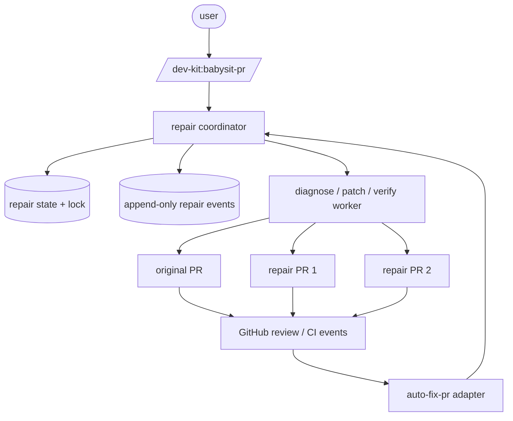
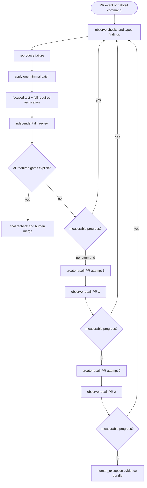
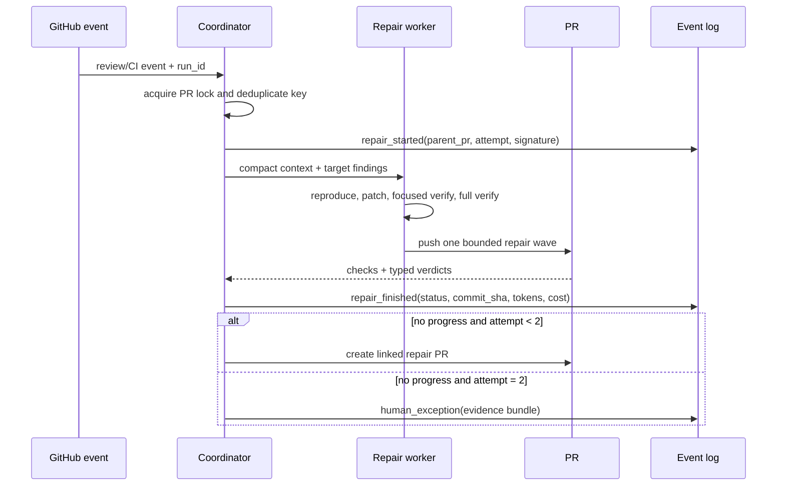
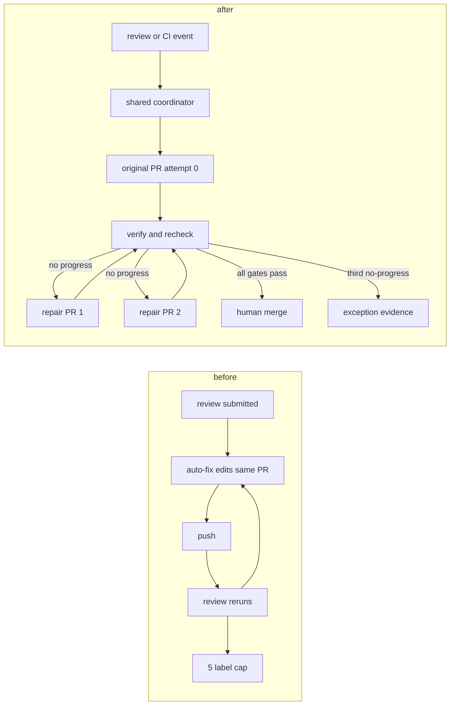
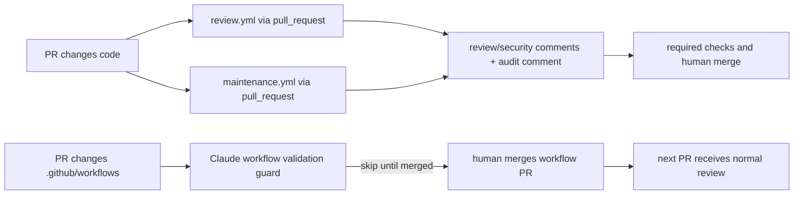

# Unified repair coordinator — Code-Viz

This document is the source-level Code-Viz record for the repair workflow.
`/dev-kit:babysit-pr` is the only user-facing repair entrypoint. GitHub Actions
only emits events into the same coordinator contract.

The dedicated Archidraw MCP rendering is documented in the
[babysit-pr architecture](../architecture/2026-08-24/babysit-pr-architecture.md)
reference. It describes the repair loop and its human merge boundary; it does
not represent a fixed commit count.

## Architecture

## Lifecycle

## Event and state contract

## Before / after

## Invariants

- `attempt` is `0`, `1`, or `2`; no fourth repair PR is created.
- `failure_signature` is deterministic and is part of duplicate suppression.
- Missing or malformed required verdicts are never approvals.
- Only one coordinator worker may modify a PR at a time.
- Every patch has focused verification, full verification, commit SHA, and an event record.
- Transcripts remain available for recovery; compact events drive analysis and token accounting.

## Current execution policy

The review and maintenance workflows run on `pull_request` and inspect the PR
in PR-head context, so the checked-out PR content remains untrusted. Fork PRs do
not receive repository secrets; the consumer CI template additionally uses a
same-repository/fork guard, while this repository's root workflows do not. A PR
that changes a workflow file can still be reported as skipped by Claude's
workflow-validation guard because the PR copy does not yet match the default
branch. That is an expected bootstrap boundary: the workflow change is merged
by a human, and the next ordinary PR exercises the updated workflow.

`/dev-kit:babysit-pr` may diagnose, patch, verify, create bounded repair PRs,
and write audit events, but it never merges into `main`. Passing gates produce
a human-merge hand-off, not an automatic merge. Missing or malformed agent
verdicts are recorded as audit evidence and do not constitute a human approval.
